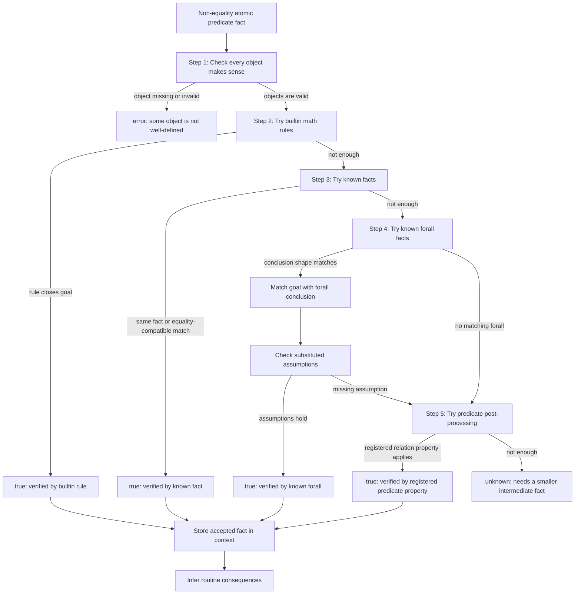

# Manual

Jiachen Shen and The Litex Team, 2026-05-06. Email: litexlang@outlook.com

Try all snippets in browser: https://litexlang.com/doc/Manual

Markdown source: https://github.com/litexlang/golitex/blob/main/docs/Manual.md

## Manual Introduction

_In science, you can say things that seem crazy, but in the long run, they can turn out to be right._

_- Jeff Hinton_

> **Beta notice:** Litex is still in beta. The language and manual are part of an ongoing experiment in formalizing everyday mathematical reasoning. Please do not use Litex for production or mission-critical proof work yet, but we welcome attention, feedback, and discussion.

> **Boundary notice:** Litex is not a replacement for Lean, Coq, or Isabelle.
> It explores a narrower interface hypothesis: users write mathematical facts,
> and the checker grows an explainable verified context. This lowers the user's
> proof-writing burden by putting more routine mathematical background in the
> checker, so the trusted base is larger than a small proof kernel. `know`
> facts are assumptions or proof debt, and builtin/infer rules are part of the
> trusted mathematical background. For a compact discussion of trust boundaries,
> comparison with Lean, and project positioning, read
> [FAQ](https://litexlang.com/doc/FAQ).

This manual explains how Litex reads and checks mathematical proof scripts. The central idea is: **users write facts; Litex grows a verified context**.

A Litex file is not just a list of theorem declarations. It executes as a sequence of mathematical statements. Each statement may introduce objects, assert facts, open a proof block, store accepted information, or trigger inference. Once a fact is verified, it becomes part of the current context and can help justify later facts.

Litex does not ask users to choose a tactic for each fact. The user states the fact they want, and the checker tries to match it against builtin rules, known facts, and known `forall` facts. Statement shapes such as chains, `by cases`, `have by exist`, `witness`, and `forall` organize the mathematical information so this matching can work. When a person reads a mathematical fact, they often recognize the pattern and remember which already-proved fact should apply; Litex is built around the same kind of shape-directed matching. G. H. Hardy said: A mathematician, like a painter or poet, is a maker of patterns; Litex is meant to reward recognizing those patterns rather than naming every packaging lemma.

Named theorems still matter. A `claim` exports a proved fact into the current context, so it is a good fit for short, local, or common facts that later goals should reuse by pattern matching. A `thm` gives an important `forall` fact a name and asks the user to call that name explicitly with `by thm name(args...)`; this is the right style for longer, classic, standard-library, or parameter-sensitive theorems. In short: use `claim` when the fact should behave like stored context, and use `thm` when the name is part of the proof interface.

This is the sense behind the slogan **Litex: The Formal Language Where Code Verifies Itself**. The code does not prove arbitrary goals by magic; it exposes mathematical facts in shapes the checker can match against builtin rules, known facts, known `forall` facts, and the growing verified context.

Litex has many builtin concepts because ordinary mathematics has many small background steps. Numbers, sets, membership, equality, functions, tuples, products, order, finite displays, and positivity facts constantly interact. Litex puts this shared background into the checker so user proofs can focus on the mathematical idea instead of repeating basic bookkeeping.

This is an intentional convenience trade-off. The trusted base is larger because
the checker directly understands many relation-level interactions between
ordinary mathematical objects. The design goal is not kernel minimality at this
stage; it is a short, explainable feedback loop where the user can write the
next mathematical fact and see whether it follows from the current context.

This is the main usability advantage of Litex: proof code can stay close to the way a person would write the argument on paper, while still producing a checked and explainable trace relative to the trusted background. For example, using a known value can be written as direct algebraic steps:

<table style="border-collapse: collapse; width: 100%; table-layout: fixed; font-size: 12px">
  <tr>
    <th style="border: 1px solid black; padding: 4px; text-align: left; width: 50%;">Litex</th>
    <th style="border: 1px solid black; padding: 4px; text-align: left; width: 50%;">Lean 4</th>
  </tr>
  <tr>
    <td style="border: 1px solid black; padding: 4px; vertical-align: top; overflow-wrap: anywhere; word-break: break-word">
<pre style="margin: 0; white-space: pre-wrap"><code>forall x R:
    x = 2
    =>:
        x + 1 = 3
        x^2 = 4</code></pre>
    </td>
    <td style="border: 1px solid black; padding: 4px; vertical-align: top; overflow-wrap: anywhere; word-break: break-word">
<pre style="margin: 0; white-space: pre-wrap"><code>import Mathlib.Tactic
example (x : ℝ) (h : x = 2) : x + 1 = 3 ∧ x ^ 2 = 4 := by
  have h_add : x + 1 = 3 := by
    rw [h]
    norm_num
  have h_square : x ^ 2 = 4 := by
    rw [h]
    norm_num
  exact ⟨h_add, h_square⟩</code></pre>
    </td>
  </tr>
</table>

Litex's checker is designed to remember known facts, use builtin arithmetic and substitution, and infer routine consequences automatically. The result is usually shorter code, fewer proof-engine details, and a lower learning burden for everyday mathematical proofs. The deeper design goal is to make formal proof feel like context growth: write facts in mathematical order, let the checker explain how each accepted fact follows, and reuse the verified context as the argument develops.

> Litex is different from Lean in design goals and surface style, but its author deeply respects Lean. For the dedicated comparison, see [Litex vs Lean](https://litexlang.com/doc/Litex_vs_Lean).

> `struct` is a preview feature. A struct view object such as `&Point` is a named view of a Cartesian product, and field access must be explicit, for example `&Point{p}.x`; bare `p.x` and `by struct` are not part of the current surface syntax.

> If you are reading this manual online, it usually helps to run the examples and inspect the output. Some examples are intentionally more explicit than the Litex kernel strictly needs: the checker can often close shorter versions automatically, but the longer form is easier to read while learning.

### Iterative Proof Workflow

Litex works well as an iterative proof-writing environment because the proof language is close to ordinary mathematical writing and the checker gives structured feedback after every attempt. For larger proofs, a useful workflow is:

1. Solve the theorem first in natural language, step by step.
2. Formalize every step in Litex, using a precise `know` only when a step is not formalized yet.
3. Repeatedly refine each broad `know` into smaller claims, facts, or helper propositions until the remaining assumptions are local and concrete.
4. After the proof works, remove lines that Litex already infers and move repeated structures into a `claim forall` or a named `prop`.

This turns `know` into temporary scaffolding rather than the final proof. The
same loop is used for larger Mechanics examples and benchmark-style tasks:
first build a readable proof skeleton, then replace broad assumptions by
smaller verified branches or record the exact language, library, rule, or
diagnostic gap that blocks the next step.

When you want to audit a file, inspect the remaining `know` facts before
calling the result complete. Each one should be replaced by a checked claim,
accepted as background, or recorded as proof debt. This audit matters because
Litex's convenience comes from a larger trusted mathematical background, not
from a small proof kernel.

For algebra, prefer explicit local steps over "obvious" jumps. A common case is zero-product reasoning: if the context has `u * v = 0` and `v != 0`, do not jump straight to `u = 0`. Write the division step and then simplify it:

```litex
claim:
    prove:
        forall a, b R:
            (2 * a - b) * (3 * a + b) = 0
            2 * a - b != 0
            =>:
                3 * a + b = 0
    3 * a + b = 0 / (2 * a - b) = 0
```

This style matches the verifier feedback loop better than a large algebraic jump: first isolate a factor by division, then simplify `0 / nonzero` to `0`.

---

### Mental model

When learning Litex, it is enough to keep the following mental model in mind. Try to connect each Litex idea with its everyday mathematical counterpart: the objects you write, the facts you claim, the statements that organize the proof, and the checker steps that justify and store those facts.

- **Objects** are the mathematical things a proof talks about: numbers, sets, tuples, functions, products, sequences, matrices, and names introduced earlier.
- **Facts** are judgments about objects: `x = 2`, `x $in N`, `0 <= x`, `$is_set(A)`, or a user-defined predicate such as `$prime(n)`.
- **Statements** are the user-facing forms that introduce objects, define concepts, organize local proofs, and assert facts.
- **Verification** proves the current goal from the context, definitions, evaluation, normalization, and builtin verification rules.
- **Execution** is what a statement does to the current context. A statement may define a name, open a proof block, verify a fact, store accepted facts, or run inference. Inference is one part of execution for factual statements: after a fact is accepted, Litex may add standard consequences or side information to the context.

The key distinction is that an expression such as `x + 1` is only an object. It becomes a fact only when a relation or predicate makes a claim about it, such as `x + 1 = 3`.

Many uncommon forms can be skipped at first. Read them when a proof needs them; the common core above is enough for most early examples.

---

### Guidance For Reading This Manual

This manual is both a tutorial and a reference. You do not need to read every section with the same attention on the first pass.

**Read first**

1. [Objects](https://litexlang.com/doc/Manual#objects): the mathematical terms and data-like structures Litex can talk about.
2. [Factual Statements](https://litexlang.com/doc/Manual#factual-statements): how atomic facts combine into chains, conjunctions, disjunctions, `exist`, and `forall`.
3. [Statements](https://litexlang.com/doc/Manual#statements): the common statement forms used to introduce definitions, context, and proof blocks.
4. [Proof Process](https://litexlang.com/doc/Manual#proof-process): the end-to-end loop from writing a fact to storing checked information.

**Read early**

1. [Builtin Verification Rules](https://litexlang.com/doc/Manual#builtin-verification-rules): the common automatic steps that make Litex proofs short, especially numeric calculation, polynomial normalization, known-value resolution, membership, order, and set facts.
2. [Builtin Predicates](https://litexlang.com/doc/Manual#builtin-predicates): the standard predicates such as `=`, `<`, `$in`, `$subset`, and `$is_set`. Skim the list first, then return when a proof needs a specific form.

**Use as reference**

1. The long builtin-rule catalogue is for lookup. You do not need to memorize every rule.
2. [Builtin Inference](https://litexlang.com/doc/Manual#builtin-inference) explains extra facts Litex may add after a statement is accepted. Read the overview early, and use the detailed rule list when you want to understand why later facts became available.
3. Less common object and statement forms, such as advanced set operations, families, induction, finite enumeration, and preview features, can wait until your proof needs them.

---

## Objects

_The whole is greater than the sum of its parts._

_— Aristotle_

### Objects as sets

Everything you write in a formula is built from a fixed menu of expression forms: numbers, identifiers, sets, functions, tuples, sums, and so on. We call these objects (they are not variables because in math anything is constant). And since Litex is set-based, all objects are sets.

The subsections below name each form in ordinary mathematical language and show typical Litex spelling.

Objects are the material that facts talk about. For the full path from objects to atomic facts, verification, storage, and inference, see [Proof Process](https://litexlang.com/doc/Manual#proof-process).

#### Names and parameters

Objects introduced by `forall`, `have`, `let`, and function parameters are atomic pieces of syntax—not built from smaller operators inside Litex.

```litex
forall x R:
    x = x
```

#### Function application

A function (given by `have fn` or by an anonymous head) applied to arguments denotes the value of the map at that point. Arguments may be grouped in several layers (curried style).

```litex
have fn f(x R) R = x + 1
f(2) = 3
```

#### Numeric literals

Decimal or integer numerals; they combine with `+`, `-`, `*`, `/`, `%`, `^`, etc.

```litex
1 + 2 = 3
```

#### Arithmetic and integer remainder

Binary operations on expressions; `%` is integer remainder when both sides are concrete integers; `^` is exponentiation. Concrete numeric evaluation is intentionally bounded, so a very large expression such as a huge power can remain symbolic instead of being expanded by brute force.

```litex
2 * 3 = 6
5 % 2 = 1
2 ^ 3 = 8
```

Litex also stores common function-space facts for these operator objects. For example, `+ $in fn(a, b R) R`, `/ $in fn(a R, b R: b != 0) R`, and `% $in fn(a Z, b Z: b != 0) Z` are available as known facts. Division also has builtin algebra rules: from `a / b = c` and `b != 0`, Litex can prove `a = c * b` and `a = b * c`; from `a = b * c` with a nonzero divisor, it can prove the corresponding quotient equality. For well-definedness, a known fact such as `a != b` is also enough to prove `a - b != 0`, so a divisor like `x - 2` can be justified by the domain condition `x != 2`. Exponentiation is stored as one function-space fact with an `or` domain condition covering the standard well-defined cases, including the natural-exponent convention `0^0 = 1`. Natural-number powers preserve `Z`, `N`, and `N_pos`: for example, if `a $in N_pos` and `k $in N`, then `a^k $in N_pos`. Integer floor and ceiling live in `std/Int`, not the builtin environment: after `import Int`, use `Int::floor(x)` and `Int::ceil(x)` with the bounds and uniqueness theorems from that module.

#### `abs`, `sqrt`, `log`, `max`, `min`

Absolute value, square root, logarithm (base and argument follow Litex parsing rules), and binary maximum and minimum. `sqrt(x)` is well-defined when `x $in R` and `0 <= x`.

```litex
forall x R:
    0 <= x
    =>:
        abs(x) = x
        sqrt(x) = sqrt(x)
```

#### Union, intersection, set difference

Set operations use ordinary function-call form: `union(A, B)` and
`intersect(A, B)` for union and intersection, with `set_minus(A, B)` and
`set_diff(A, B)` for differences.

```litex
2 $in union({1, 2}, {2, 3})
2 $in intersect({1, 2}, {2, 3})
have t set = set_minus({1, 2}, {1})
```

When Litex records **`x $in intersect(A, B)`**, membership inference also stores **`x $in A`** and **`x $in B`** so later steps can use each side directly. Likewise, **`x $in set_minus(A, B)`** yields **`x $in A`** and **`not x $in B`**.

```litex
1 $in union({1}, {2})
```

#### Big union and big intersection (`cup`, `cap`)

Union and intersection over an indexed collection of sets; in Litex this is `cup(...)` and `cap(...)` on a suitable “set of sets.” Short illustrative proofs often need extra side conditions on the inner sets—see comments in `examples/03_objects_and_data/litex_object_examples.lit`.

#### Power set

`power_set(X)` (often written as `P(X)`): all subsets of `X`, for the finite-style uses Litex supports here.

```litex
{1, 2} $in power_set({1, 2, 3})
```

#### Enumerated sets

Finite sets written as `{a, b, ...}`.

```litex
1 $in {1, 2, 3}
```

#### Set comprehension

Set-builder form: `{ z in T | condition on z }`.

```litex
have s set = { z N : z > 5 }
```

#### Function types and anonymous functions

A **function space** is written `fn(x S) T`; an anonymous function value can be written with a `'R(x){...}`-style head and applied directly. Function application must include at least one argument, so `f()` is not valid syntax. The parameter domains and return type are ordinary set objects, such as `R` or `Point`; struct view objects are preview syntax and are not valid inside a `fn` signature.

Later parameter domains may depend on earlier parameters. The return set is not dependent on the function parameters, so a signature such as `fn(n N_pos) closed_range(1, n)` is rejected.

The range object `fn_range(f)` means the set of values reached by `f`, using the function set already known for `f`. It is not a separate restriction object. If `f` has return set `T`, then `fn_range(f) $subset T`, `fn_range(f) $in power_set(T)`, and a well-defined value `f(a)` is in `fn_range(f)`.

```litex
have g set = fn(x R) R
```

```litex
have h fn(n N_pos, x closed_range(1, n)) R
```

```litex
prove:
    struct Point:
        x R
        y R
```

```litex
'R(x){x + 1}(2) = 3
```

```litex
prove:
    have f fn(x R: x > 0) R

    f(1) $in fn_range(f)
    fn_range(f) $subset R
    fn_range(f) $in power_set(R)
```

#### Cartesian product and dimension

`A cross B cross ...`; `cart_dim` gives the number of factors when the value is recognized as a product.

```litex
let d set:
    d = cart(R, Q)
$is_cart(d)
cart_dim(d) = 2
```

#### Projection from a product

Pick one factor of a Cartesian product.

```litex
proj(cart(R, Q), 1) = R
```

#### Tuples and length

Ordered tuples `(a1, ..., an)` and their length.

```litex
(1, 2) = (1, 2)
```

```litex
let e set:
    e = (2, 3)
$is_tuple(e)
tuple_dim(e) = 2
e[1] = 2
```

#### Struct objects and explicit field access

`&Name<args>` is a preview object form for parameterized structs. It names the Cartesian product determined by the struct fields, with any `<=>:` facts treated as membership filters. Field access does not infer a struct from the object; it must say which struct view is being used.

```litex
struct Point:
    x R
    y R

have p &Point = (1, 2)
&Point{p}.x = p[1]
&Point{(1, 2)}.y = 2
```

The explicit prefix is necessary because the same object may belong to several struct objects, and the same field name may mean different tuple positions in different struct views.

```litex
struct Point1:
    x R
    y R

struct Point2:
    y R
    x R

(1, 2) $in &Point1
(1, 2) $in &Point2
&Point1{(1, 2)}.x = 1
&Point2{(1, 2)}.x = 2
```

This is a basic difference from Lean-style field notation. In Litex, an object may be in many sets at once; it does not belong to one unique class or type that determines all later field access. Lean can often support `x.y` because `x` has a unique type, and that type tells Lean which field `y` means. Litex instead asks the user to write the view explicitly, such as `&Point1{x}.x` or `&Point2{x}.x`.

The well-definedness of `&Point{p}.x` reduces to proving `p $in &Point`. A declaration such as `forall p &Point:` or `have p &Point = ...` provides that membership fact in the local context.

After Litex knows `p $in &Point`, it also stores the field facts such as `&Point{p}.x $in R`, `p[1] $in R`, `&Point{p}.y $in R`, and `p[2] $in R`. If the struct has `<=>:` filter facts, those facts are stored twice: once with each field name replaced by its explicit field access, and once with each field name replaced by its tuple projection. When checking that a tuple itself belongs to a struct object, Litex can instantiate the `<=>:` facts directly with the tuple components.

If a struct has no `<=>:` filter facts, Litex can prove `&Name<args>` is nonempty when every instantiated field type is nonempty. Structs with `<=>:` filters may need an explicit nonempty witness, because the filters can rule out some tuples.

#### Counting members

Size of a finite set. Litex knows that the count of a finite set is a natural number. For two finite sets, `union`, `intersect`, `set_minus`, and `set_diff` are finite; a Cartesian product `cart(A, B, ...)` is finite when every factor is finite, and `count(cart(A_1,...,A_n))` reduces to `count(A_1) * ... * count(A_n)` in calculations. It also knows basic upper bounds such as `count(intersect(A, B)) <= count(A)` and `count(union(A, B)) <= count(A) + count(B)`, plus count identities for `union`, `set_minus`, and `set_diff`.

```litex
count({1, 2, 3}) = 3
$is_finite_set(cart({1, 2}, {3, 4, 5}))
count(cart({1, 2}, {3, 4, 5})) = count({1, 2}) * count({3, 4, 5})
$is_finite_set(union({1, 2}, {2, 3}))
$is_finite_set(intersect({1, 2}, {2, 3}))
forall A, B finite_set:
    $is_finite_set(union(A, B))
    $is_finite_set(intersect(A, B))
count(union({1, 2}, {2, 3})) <= count({1, 2}) + count({2, 3})
count(union({1, 2}, {2, 3})) = count({1, 2}) + count({2, 3}) - count(intersect({1, 2}, {2, 3}))
count(set_minus({1, 2}, {2, 3})) = count({1, 2}) - count(intersect({1, 2}, {2, 3}))
```

#### Finite `sum` and `product`

Summation and products over a bounded integer index with one expression body (indexed by a name like `x`).

```litex
sum(1, 3, '(x Z) Z {x}) = sum(1, 2, '(x Z) Z {x}) + '(x Z) Z {x}(3)
```

#### Integer intervals as sets

Half-open `range(m, n)` and closed `closed_range(m, n)` as set-valued expressions (membership goals may need surrounding proofs).

```litex
have r set = range(0, 10)
have w set = closed_range(0, 1)
```

```litex
have q set = 0 ... 1
```

#### Real intervals as sets

Two-sided real intervals use `oo(a, b)`, `oc(a, b)`, `co(a, b)`, and `cc(a, b)`. Half-infinite real intervals use `info(a)`, `infc(a)`, `oinf(a)`, and `cinf(a)`.

```litex
have left set = info(1)
have right set = cinf(0)
```

Membership unfolds to real membership and the endpoint bounds. For example, `x $in info(a)` gives `x $in R` and `x < a`; `x $in cinf(a)` gives `x $in R` and `a <= x`.

#### Sequence- and matrix-style index sets

Some indexed objects use **sequence** types or matrix index domains (repeated indices, `closed_range` on each axis) instead of a single `sum` index. Typical patterns appear with `have fn M(i …, j …) …` (see below).

#### Choice functions

Use `by axiom_of_choice: set S:` to assert the existence of a function that picks one element from each member of a family of nonempty sets. Litex no longer has a special `choose(s)` object constructor.

```litex
have S set

by axiom_of_choice: set S:
    know forall A S:
        $is_nonempty_set(A)

exist f fn(A S) cup(S) st {forall! A S: {f(A) $in A}}
```

#### Standard number sets

Names such as `R`, `Q`, `Z`, `N`, `N_pos`, and related signed or punctured variants.

```litex
0 $in Z
```

#### Matrices

Litex supports matrices in three related ways: a constructor **type** `matrix(S, row_count, col_count)`, **literal** rectangular arrays `[[row1], [row2], …]`, and the same **indexed function space** pattern used for “matrices as maps” from a row–column index set into `S`.

**Type and literal.** You can bind a matrix object to a literal and read entries with two indices (like applying a function of two arguments):

```litex
prove:
    matrix(R, 2, 2) = matrix(R, 2, 2)

    have a matrix(R, 2, 2) = [[1, 2], [3, 4]]

    a $in fn (x1 N_pos, x2 N_pos: x1 <= 2, x2 <= 2) R

    a(1, 1) = 1
    a(1, 2) = 2
    a(2, 1) = 3
    a(2, 2) = 4
```

**Matrix algebra (surface operators).** These are **not** the scalar operators `+`, `-`, `*`, `^`. For two matrices of matching shape, `++` is cell-wise sum and `--` cell-wise difference. For compatible sizes, `**` is matrix product (columns of the left match rows of the right). For scalar `c` and matrix `A`, `c *. A` is scalar multiplication. For a square matrix and exponent `n` in `N_pos`, `A ^^ n` is matrix power.

```litex
eval [[1, 0], [0, 1]] ++ [[1, 0], [0, 1]]
```

```litex
eval [[2, 0], [0, 2]] -- [[1, 0], [0, 1]]
```

```litex
eval [[1, 2], [0, 1]] ** [[1, 0], [1, 1]]
```

```litex
eval [[1 / 2, 1 / 3], [0, 1]] ** [[1, 0], [1 / 6, 1 / 2]]
```

```litex
eval 3 *. [[1, 2], [4, 5]]
```

```litex
eval [[2, 0], [0, 2]] ^^ 2
```

**Named matrices.** The same operators work on matrix objects (e.g. after `have m matrix(R, 2, 2) = …`).

```litex
have m matrix(R, 2, 2) = [[1, 0], [0, 1]]

eval m ++ m

eval m ** m

eval 2 *. m
```

---

## Factual Statements

_I think, therefore I am._

_— René Descartes_

A **factual statement** is a Litex statement that claims a mathematical fact. It may be as small as `1 = 1`, or as structured as a `forall`, `exist`, `or`, or chain of inequalities.

The result of checking any factual statement has exactly one of three statuses: **true**, **unknown**, or **error**.

- **true** means Litex found a proof path, such as a builtin rule, a known fact, or a known `forall` fact.
- **unknown** means the statement is meaningful, but Litex did not find enough verified information to close the goal. The fact may be false, or it may simply need more intermediate facts.
- **error** means Litex cannot check the line as a valid fact. The syntax may be wrong, or some object may not be well-defined, such as an undeclared name, a function argument outside its domain, or `1 / 0`.

Once a factual statement is verified, it becomes a **known fact** in the current context and can be reused by later statements.

> Hint: `unknown` is usually a request for a smaller step. Try stating the missing equality, membership, domain condition, or previous lemma explicitly. `error` is different: first fix the syntax or make every object well-defined.

This page is about **facts themselves**. For the larger list of Litex statement forms such as `prop`, `have`, `claim`, `prove`, `know`, and `witness`, see [Builtin statements](https://litexlang.com/doc/Manual#statements).

This page mainly lists the **types of facts** Litex can read and how they are shaped. For how those facts are actually proved by the checker, read [Proof Process](https://litexlang.com/doc/Manual#proof-process) and [Builtin Verification Rules](https://litexlang.com/doc/Manual#builtin-verification-rules).

---

### Quick mental model

Think of Litex as checking one sentence at a time:

```litex
1 + 1 = 2
```

Litex asks:

1. Are the terms well-defined?
2. What shape is this fact?
3. Can the fact be proved from what is already known?
4. If the fact is compound, can its smaller parts be checked?

If the syntax or well-definedness check fails, the result is `error`. If the
fact is meaningful but no proof route succeeds, the result is `unknown`. If a
route succeeds, the result is `true`.

For example:

```litex
have x R = 2
x + 1 = 3
```

The second line works because `x` is already known to be `2`, so the equality can be reduced to a numeric equality.

---

### Shapes of facts

Different fact shapes are verified in different ways, but they all reduce to the same idea: Litex must justify the claim from the current context.

| Shape | Meaning | Example |
|-------|---------|---------|
| **Atomic fact** | One basic claim: equality, order, membership, or one predicate call. | `1 = 1`, `2 < 3`, `1 $in {1, 2}`, `$is_set(R)` |
| **Atomic negation** | Negation of one atomic claim. | `2 != 3`, `not 1 < 0` |
| **Conjunction** | Several atomic facts all hold. | `1 = 1 and 2 < 3` |
| **Chain** | Shorthand for adjacent comparisons. | `0 < 1 < 2` |
| **Disjunction** | At least one branch holds. | `1 = 2 or 1 = 1` |
| **Existential fact** | **Inline witness form**: `exist`, `exist!`, or `not exist`, followed by `st { ... }`. | `exist x R st { x = 1 }` |
| **Universal fact** | For all typed variables, conclusions hold. | `forall! x R: x = x`, or block `forall x R:` |
| **Universal with equivalence** | A universal fact with an equivalent reformulation. | block `forall ...` with `<=>:` |
| **Negated universal** | A universal claim is false. | `not forall x R: x > 0` |

---

### Atomic facts

An **atomic fact** is one indivisible mathematical claim. It is made from a **predicate** and its **arguments**. The predicate is the judgment being made; the arguments are the objects being judged. Some predicates are built into Litex because they correspond to basic mathematical ideas, such as equality `=`, order `>`, membership `$in`, subset `$subset`, and set predicates like `$is_set`.

If [Objects](https://litexlang.com/doc/Manual#objects) are the mathematical things you talk about, predicates are the basic ways to make judgments about them. In ordinary mathematical language, they are the verbs of small facts:

```text
1 + 1       // an object
1 + 1 = 2   // a fact
2           // an object
2 $in N     // a fact
```

Common atomic facts:

```litex
1 + 1 = 2
```

Here `=` is the main relation(predicate), and `1 + 1` and `2` are the arguments. This factual statement is true by calculation.

> Note: In Litex, expressions such as `1 + 1`, `x - y`, or `f(x)` are usually treated as **objects** or **terms**. They name values. They are not facts by themselves, so they are not true or false.

> Note: The **verb** of a factual statement is the part that makes a judgment: `=`, `!=`, `<`, `$in`, `$is_set(...)`, or a custom predicate such as `$is_one(...)`. For example, `1 + 1` has no truth value, but `1 + 1 = 2` does.

> Hint: When reading an atomic fact, first find the verb that is being checked. The remaining pieces are the objects the verb talks about.

More examples with builtin predicates:

```litex
2 != 3
0 < 1
not 1 < 0
1 $in {1, 2}
$is_set({1, 2})
```

> Note: Builtin predicates and builtin objects are connected by many builtin verification rules. These predicates and rules are the common concepts and rules from basic mathematics, not advanced hidden machinery. Each single rule is usually intuitive: for example, `1 $in {1, 2}`, `2 < 3`, `2 != 3`, or `$is_set({1, 2})`. The surprising part is the total size of the background knowledge. Basic mathematics has many small relationships, and Litex has hundreds of them built in for standard numbers, sets, functions, tuples, comparisons, equality, and membership.

> Note: Because of this, using builtin predicates and builtin objects is often much more convenient than rebuilding the same ideas with custom predicates. When you write facts with standard forms such as `$in`, `$is_set`, `=`, `<`, `R`, `Z`, or `{1, 2}`, Litex can often use hundreds of built-in relationships behind the scenes.

> Hint: Prefer builtin predicates and builtin objects when they express what you mean. Use custom `prop` definitions when you need a new mathematical idea that is not already covered by the builtin vocabulary.

Custom predicates defined by `prop` are also atomic when you call them:

```litex
prop is_one(x R):
    x = 1

$is_one(1)
```

The call `$is_one(1)` is atomic. Litex can unfold the `prop` definition and check that `1 = 1`.

> Hint: A predicate definition is written with `prop is_one(...)`, but a predicate fact is called with `$is_one(...)`.

Atomic facts are usually checked by:

- direct computation, such as `2 + 3 = 5`;
- known definitions, such as a `prop` body or a `have fn` equation;
- already known facts in the current context;
- builtin verification rules for equality, order, membership, sets, tuples, numbers, and similar standard objects.

> Hint: Before Litex proves an atomic fact, it must also know that the expressions make sense. For example, using a variable usually requires that the variable has already been introduced with a type such as `have x R`.

---

### Conjunctions

A **conjunction** says that several atomic facts all hold.

```litex
1 = 1 and 2 < 3
```

This means the same thing as writing the two facts separately:

```litex
1 = 1
2 < 3
```

Litex style usually prefers the second form. It is easier to read, and when something becomes `unknown`, the failing line is clearer.

> Hint: Use `and` inside compact bodies such as `exist x R st { ... }` only when it improves readability. In ordinary proof blocks, one fact per line is usually better.

---

### Chains

A **chain** is a compact way to write adjacent binary relations.

```litex
0 < 1 < 2
```

Logically, this means:

```litex
0 < 1 and 1 < 2
```

Chains are not a new kind of mathematical logic. They are shorthand for smaller atomic comparisons, and Litex may also use order facts to derive convenient consequences.

```litex
0 < 1 < 2
0 < 2
```

When several comparisons belong to the same ordered path, prefer a chain such as `a < b < c` instead of writing separate facts such as `a < b` and `b < c`. The chain is shorter, shows the structure more clearly, and gives Litex a direct shape for applying builtin order support.

> Hint: If a chain is hard to debug, split it into its adjacent pieces first.

> Hint: Try to use `<` consistently instead of switching back and forth between `<` and `>`. For example, prefer `a < b < c` over `c > b > a` when either form would say the same thing. A consistent direction makes proof steps easier to read and easier for builtin order rules to match.

---

### Disjunctions

A **disjunction** says that at least one branch holds.

```litex
1 = 2 or 1 = 1
```

Litex can verify this because the second branch is true.

A branch is usually an atomic fact, a conjunction of atomic facts, or a chain.

> Hint: To prove `A or B`, it is enough for Litex to prove one side.

Disjunctions also work together with the `by cases` statement. After Litex knows `A or B`, `by cases` can split the proof into one branch where `A` is assumed and another branch where `B` is assumed.

```litex
have x R

by cases:
    prove:
        x = 0 or x != 0
    case x = 0:
        ...
    case x != 0:
        ...
```

> Hint: Think of `or` as the factual statement shape, and `by cases` as the proof statement that uses that shape.

---

### Existential facts

An **existential fact** says that there is a witness satisfying some conditions.

```text
exist x R st { x = 1 }
```

Read this as: there exists an `x` in `R` such that `x = 1`.

You can also state uniqueness:

```text
exist! x R st { x = 0 }
```

And non-existence:

```text
not exist x R st { x != x }
```

The body after `st` is the list of facts the witness must satisfy.

> Hint: To prove an `exist` goal, Litex usually needs a concrete witness. In proof code, use `witness` when you want to tell Litex which object should be used as the witness.

> Hint: To use an already known `exist` fact, use `have by exist` to give names to the witnesses and bring their body facts into the current context.

Example:

```litex
know exist u R st { u = 1 }

have by exist v R st { v = 1 }: h
h = 1
```

Warning: an `exist` witness is local to the existential fact. A known `forall` may be used only with an argument that is meaningful outside that local witness scope.

For example, this known fact says that every real number can be copied as some witness:

```text
know forall x R:
    exist y R st {y = x}
```

It does **not** imply the following:

```text
exist z R st {z = z + 1}
```

The object used for the `forall` parameter would have to be the local witness itself, or an expression depending on it. That is not a valid instantiation: after leaving the `exist` body, the witness name no longer denotes an object. The same issue can appear through larger expressions that mention local free parameters, such as set-builder bodies, function-set bodies, definition-header parameters, induction parameters, algorithm parameters, or struct-field parameters.

---

### Universal facts

A **universal fact** says that something holds for every object of a given type.

```litex
forall x R:
    x = x
```

Read this as: for every `x` in `R`, `x = x`.

A universal fact can also have assumptions before `=>:`:

```litex
forall x R:
    0 < x
    =>:
        x != 0
```

Read this as: for every `x` in `R`, if `0 < x`, then `x != 0`.

The lines before `=>:` are the **domain assumptions** or **hypotheses**. The lines under `=>:` are the **conclusions**.

> Hint: Without assumptions, put conclusions directly under `forall`. With assumptions, put the assumptions first, then `=>:`, then indent the conclusions one more level.

Compact `forall!` syntax is also available for short facts:

```litex
forall! x R => {x = x}
forall! x R: x > 0 => {x != 0}
```

For beginners, block form is often clearer.

---

### Universal facts with equivalence

Sometimes a universal statement says that two descriptions are equivalent. Litex writes this with `<=>:`.

```litex
forall x, y R:
    =>:
        x > y
    <=>:
        y < x
```

Read this as: under the same variables and assumptions, `x > y` is equivalent to `y < x`.

> Hint: Use `<=>:` when both directions are intended. If you only need one direction, use an ordinary `forall` with `=>:`.

---

### Negated universal facts

A **negated universal** says that a universal claim is not true.

```text
not forall x R:
    x > 0
```

Read this as: it is not true that every real number is greater than `0`.

> Hint: `not forall` is different from putting `not` inside the conclusion. If you want to say there is a counterexample to a universal claim, use `not forall`.

---

## Builtin Predicates

_Geometry, like arithmetic, requires for its logical development only a small number of simple, fundamental principles._

_- David Hilbert_

This page lists the **builtin predicates** that Litex recognizes as atomic facts. It follows the atomic fact forms handled by the kernel.

For the general idea of atomic facts, including the idea that a fact is made from a predicate and its arguments, read [Factual Statements](https://litexlang.com/doc/Manual#factual-statements). For how these predicates are proved automatically, read [Builtin Verification Rules](https://litexlang.com/doc/Manual#builtin-verification-rules).

---

### Equality and Order

These predicates compare two objects, usually numeric expressions.

| Predicate | Negated form | Meaning |
|-----------|--------------|---------|
| `a = b` | `a != b` | `a` and `b` denote the same value. |
| `a < b` | `not a < b` | `a` is strictly less than `b`. |
| `a > b` | `not a > b` | `a` is strictly greater than `b`. |
| `a <= b` | `not a <= b` | `a` is less than or equal to `b`. |
| `a >= b` | `not a >= b` | `a` is greater than or equal to `b`. |

---

### Set Predicates

These predicates say what kind of set-like object Litex is seeing.

| Predicate | Negated form | Meaning |
|-----------|--------------|---------|
| `$is_set(A)` | `not $is_set(A)` | `A` is treated as a set object. |
| `$is_nonempty_set(A)` | `not $is_nonempty_set(A)` | `A` has at least one element. |
| `$is_finite_set(A)` | `not $is_finite_set(A)` | `A` is finite in the sense Litex uses for standard finite objects. |

---

### Membership

Membership is the set-theoretic version of a type assertion.

| Predicate | Negated form | Meaning |
|-----------|--------------|---------|
| `x $in A` | `not x $in A` | `x` is an element of `A`. |

---

### Shape Predicates

These predicates recognize common data shapes.

| Predicate | Negated form | Meaning |
|-----------|--------------|---------|
| `$is_cart(C)` | `not $is_cart(C)` | `C` is a Cartesian product. |
| `$is_tuple(t)` | `not $is_tuple(t)` | `t` is a tuple value. |

---

### Set Inclusion

These predicates express inclusion between sets.

| Predicate | Negated form | Meaning |
|-----------|--------------|---------|
| `A $subset B` | `not A $subset B` | Every element of `A` belongs to `B`. |
| `A $superset B` | `not A $superset B` | Every element of `B` belongs to `A`. |

---

### Function Restriction

This predicate says whether a function can be viewed as having a smaller or more constrained function type.

| Predicate | Negated form | Meaning |
|-----------|--------------|---------|
| `f $restrict_fn_in T` | `not f $restrict_fn_in T` | `f` can be restricted to the function space `T`. |

---

### Function Equality

These predicates express equality of functions.

| Predicate | Meaning |
|-----------|---------|
| `$fn_eq_in(f, g, S)` | `f` and `g` agree at every argument in `S`. |
| `$fn_eq(f, g)` | `f` and `g` are globally equal as function values. |

---

### Not Builtin: User Predicates

Calls such as `$p(x)` are also atomic facts, but they are not builtin predicates. They come from user declarations such as `prop p(...)` or `abstract_prop p(...)`, and Litex verifies them from the user's definition or known facts.

---

## Statements

_If you can't explain it to a six year old, you don't understand it yourself._

_- Albert Einstein_

A **statement** is a basic line or block of Litex code. You use statements to do mathematical reasoning, make definitions such as `prop`, functions, and sets, and prove facts from known facts or axioms.

This page is a practical reference. Read each section as: **what the statement means**, **when to use it**, and **what shape the code usually has**.

Statements are the outer actions in a Litex file. Some statements contain [Factual Statements](https://litexlang.com/doc/Manual#factual-statements), which are checked through the flow described in [Proof Process](https://litexlang.com/doc/Manual#proof-process).

---

### Assert a fact

Write a fact directly when you want Litex to verify it from what is already known. Facts include equality, order, membership, `forall`, `exist`, and compound facts with `and` / `or`.

```litex
1 + 1 = 2
```

> Hint: A bare fact should already follow from the current context. If you want to prove a fact in a sub-proof and add only the final fact back to the current context, use `claim:`.

Common fact types:

| Kind | Fact type | Example |
|------|-----------|---------|
| Atomic fact | Equality | `1 + 1 = 2` |
| Atomic fact | Inequality / order | `2 < 3`, `3 <= 3` |
| Atomic fact | Membership | `2 $in R` |
| Atomic fact | Predicate fact | `$prime(17)` |
| Atomic fact | Atomic negation | `2 != 3`, `not 1.1 $in Z` |
| Compound fact | Conjunction | `1 < 2 and 2 < 3` |
| Compound fact | Disjunction | `1 < 2 or 1 >= 2` |
| Compound fact | Chain | `1 <= 2 = 2 < 3` |
| Quantified fact | Existence | `exist x R st {x > 0}` |
| Quantified fact | Unique existence | `exist! x R st {x = 0}` |
| Quantified fact | Universal fact | `forall! x R: x = x` |

For a fuller explanation, see [Factual Statements](https://litexlang.com/doc/Manual#factual-statements).

---

### Named predicate (`prop`)

Use **`prop`** to name a mathematical property. The body says what the property means.

After a `prop` is defined, Litex can verify later predicate facts by using that definition. In the example below, `$p(1)` holds because `1 $in R` and `1 = 1`.

```litex
prop p(x R):
    x = x

$p(1)
```

> Example: after defining `prop p(x R): ...`, you can write `$p(1)` instead of repeating the definition each time.

---

### Abstract predicate symbol (`abstract_prop`)

Use **`abstract_prop`** when you want a predicate symbol but do not want to define it yet. It only declares the name; it does not give the predicate any mathematical property by itself.

This is useful and dangerous. It is useful for axiomatized theories, examples,
and proof skeletons where the vocabulary must exist before all definitions are
ready. It is dangerous because a reader may see `$p(x)` and assume the predicate
already has meaning. It does not. The meaning must come from a later checked
definition or theorem, or from an explicit trusted assumption.

If you want an abstract predicate to have a property before proving it,
introduce that property with `know`; that makes the property trusted input for
the current development.

```litex
abstract_prop p(x)

know forall x R:
    $p(x)

$p(1)
```

> Hint: use `prop` when you can give a definition. Use `abstract_prop` when you intentionally need an uninterpreted predicate, and audit every `know` fact that gives it mathematical behavior.

---

### Typed parameters (`have`)

Use **`have x S`** to introduce a new object `x` of `set` or `nonempty_set` or `finite_set` or set like `R`(real numbers), `Z`(integers), `{1, 2, 3}`(enumerated set), `cart(R, Z)`(Cartesian product), etc. We say `x` has *type* `S`.

```litex
have x R, y Z
```

This records that `x` belongs to `R` and `y` belongs to `Z`, so later facts can use them.

> Hint: `have x S` is not a free way to create an element of any set. Litex must be able to verify that `S` is nonempty, for example by knowing `$is_nonempty_set(S)`, before it can introduce a new object `x` with `x $in S`.

### What "type" means in Litex?

The word **type** in Litex does not mean a type in type theory. Litex is based on set theory. A parameter type is one of a few surface forms:

```litex
have x R
have A set
have B nonempty_set
have C finite_set
```

`have x R` means `x $in R`: the "type" `R` is a set that contains `x`.

`set`, `nonempty_set`, and `finite_set` are closer to actions than ordinary object types. They introduce a new name and record facts about it:

```litex
have A set
have B nonempty_set
have C finite_set

$is_set(A)
$is_nonempty_set(B)
$is_finite_set(C)
```

Since Litex follows the set-theoretic view, every object you introduce is an object in the set-theoretic universe. In this sense, `$is_set(x)` holds for any introduced object `x`.

The same parameter-type idea also appears in `forall`, `exist`, `prop`: you can write parameters such as `forall x R, y set:` or `exist A set st { ... }`. Function signatures are more restrictive. When defining a function, each input position must use an object as its domain, such as `fn(x R) Z`; you cannot use action-like forms such as `set`, `nonempty_set`, or `finite_set` as a function input requirement.

---

### Defined constant (`have … = …`)

Use **`have a S = expr`** to introduce a name and fix its value. For example, `have a R = 1` introduces a constant `a` with value `1` and in set `R`.

```litex
have a R = 1
a = 1
```

> Hint: use this for constants. A function should normally be introduced with `have fn`.

---

### Naming witnesses (`have by exist`)

When an existential fact is already known, **`have by exist`** gives names to its witnesses. After that, you can use the witness properties directly.

```litex
know exist u R st {u > 0, u < 1}
have by exist v R st {v > 0, v < 1}: w
w > 0
```

---

### Naming preimages (`have by preimage`)

When a range-membership fact `z $in fn_range(f)` is already verified, **`have by preimage`** introduces a fresh preimage witness. The statement stores the witness parameter facts, the function-domain facts, and the equality from the target value back to the function application.

```litex
prove:
    have f fn(x R: x > 0) R

    f(1) $in fn_range(f)
    have by preimage x from f(1) $in fn_range(f)

    x $in R
    x > 0
    f(1) = f(x)
```

For a multi-argument function, provide one preimage name per function parameter:

```litex
prove:
    have g fn(x R, y R: x < y) R

    g(0, 1) $in fn_range(g)
    have by preimage a, b from g(0, 1) $in fn_range(g)

    a $in R
    b $in R
    a < b
    g(0, 1) = g(a, b)
```

---

### Function from one defining equation (`have fn … = …`)

Use **`have fn f(x S) T = body`** when the value of the function is given by one expression. The return part `T` is checked as the set that contains the function value.

```litex
have fn f(x R) R = x + 1

forall x R:
    f(x) $in R
    f(x) = x + 1
```

> Example: this says that for each `x R`, the value `f(x)` satisfies `f(x) $in R` and `f(x) = x + 1`.

---

### Parameterized definitions over arbitrary sets (`template`)

Use **`template`** when you want to define a whole family of objects or functions, indexed by parameters such as a set `s`.

The word is inspired by C++ templates. In C++, a template is used to define a function or data structure uniformly over many possible types. Litex uses the same idea for mathematics: a template defines a family of mathematical objects, functions, or structures uniformly over many possible parameters.

Why not just use an ordinary Litex function? Because Litex functions are set-theoretic functions. A function input must range over one object domain, such as `R`, `Z`, or a previously introduced set. But `set` in a header is not a single set containing all sets; it is a parameter kind that says the new parameter must satisfy `$is_set(s)`. The collection of all sets is not itself treated as one Litex set object. So if you want to say "for every set `s`, define a function on `s`", the parameter `s` belongs in the *header of the definition itself*, not as an ordinary function input.

This also explains why the body of a template contains ordinary statements such as `have`. A template does not bypass mathematical existence checks. It opens a parameterized context, assumes the header parameters and header facts, and then checks the declarations inside that context. If the template declares a function, object, or other data by `have`, Litex still has to verify that the declaration is meaningful under the template assumptions.

The template name is the single object or function name introduced by the body statement. For example, `template<s set>:` followed by `have fn always_one(x s) R = 1` defines the template instance name `\always_one<...>`.

For example, suppose that for every nonempty set `s` you want a function that sends every element of `s` to `1`. This is naturally a template:

<!-- litex:skip-test -->
```litex
template<s set: $is_nonempty_set(s)>:
    have fn always_one(x s) R = 1

\always_one<R>(2) = 1
```

The point is that `s` is a parameter of the definition. After you instantiate the template at `R`, the result `\always_one<R>` is an ordinary function with domain `R`.

Templates are also useful when the result is not a function. For example, you may want a family of objects that sends every parameter to `1`. This is not an ordinary function definition either, because the "domain" would be "all objects that are sets", not one fixed set object.

```litex
template<s set>:
    have always_one set = 1

\always_one<R> = 1
\always_one<2> = 1
```

Here `\always_one<R>` and `\always_one<2>` are two instantiated objects, and both reduce to `1`.

> Hint: a good rule of thumb is: if you want to define something uniformly for every choice of a parameter such as a set, and that parameter cannot be the input of one ordinary function, use `template`.

> Hint: a template instance is materialized only after instantiation. You write the family once, then use `\name<args>` to get the concrete object or function for those arguments.

---

### Piecewise function (`have fn ... by cases`)

Use **`case`** branches when the formula for a function depends on conditions.

```litex
have fn g(z R) R by cases:
    case z = 2: 3
    case z != 2: 4

forall z R:
    g(z) $in R

forall z R:
    z = 2
    =>:
        g(z) = 3

forall z R:
    z != 2
    =>:
        g(z) = 4
```

> Hint: the cases should cover the domain you intend to use.

---

### Function from unique existence (`have fn ... as set: forall ... exist!`)

Use this when mathematics tells you that for every input there exists a **unique** output. Litex then introduces the corresponding function.

```litex
abstract_prop p(x)
abstract_prop F(x, y)
have A set
have B set

know forall x A:
    $p(x)
    =>:
        exist! y B st {$F(x, y)}

have fn f as set:
    forall x A:
        $p(x)
        =>:
            exist! y B st {$F(x, y)}

forall x A:
    $p(x)
    =>:
        $F(x, f(x))
```

> Meaning: the unique witness `y` is now named by the function value `f(x)`.

> Hint: the `forall` after `by` must already be known. Its conclusion must be exactly one `exist!` fact with one output parameter.

> Hint: `as set` is the current syntax for "define a function from unique existence." It is not a return-type annotation. The return set comes from the `exist!` witness type, such as `exist! y B ...`.

Classic structure example: `examples/04_structures/group_quotient.lit` combines
`struct`, `template`, and `have fn ... as set` to define the quotient set of a
group by taking the set of left cosets. It also adds the quotient
multiplication interface for a normal subgroup and proves the representative
independence lemmas needed for well-definedness.

<!-- litex:skip-test -->
```litex
template<s set>:
    have fn group_quotient as set:
        forall g &Group<s>, h power_set(s):
            exist! q power_set(power_set(s)) st {$is_group_quotient_set(s, g, h, q)}
```

This quotient construction is the main mathematician-facing example inside the
manual: it shows how Litex can define a reusable abstract interface and then
check the well-definedness lemmas around it.

---

### Recursive function by induction measure (`have fn ... by induc ... from ...`)

Use **`have fn ... by induc ... from ...`** to define a recursive function whose calls are justified by a decreasing measure. The function signature gives the parameters, domain facts, and return set; the `by induc` clause gives a measure and a lower bound.

When defining `h(args)`, a recursive call `h(args')` is allowed only if Litex can verify that `args'` satisfies the function domain, that the measure at `args'` is strictly smaller than the current measure, and that the measure remains above the lower bound.

Every case list must cover all possibilities in its current context, and cases must be mutually exclusive. Nested case lists are checked under their parent case assumptions.

The case body uses the parameter names from the function signature. For example, if the header is `have fn f(x Z: ...)`, the recursive branch should call `f(x - 1)`, not `f(n - 1)`.

```litex
have fn h(a Z, b Z: a >= 0, b >= 0) R by induc abs(a) + abs(b) from 0:
    case b = 0: a
    case b > 0: h(a, b - 1) + 1
```


---

### Object definition without  (`let`)

Use **`let`** to introduce names together with assumptions or definitions about them. The names are local to the surrounding proof or block.

```litex
let a R:
    a = 1
a = 1

let b, c R:
    b < c

b < c
```

> Hint: `let` and `know` both introduce new facts without verification. Litex allows this and warns you because these statements are useful when you intentionally add axioms or temporary assumptions, but abusing them can make the system unsound. In most cases, do not use them; use `have`, a bare fact, or `claim` when you want Litex to verify the reasoning.

### Algorithm and evaluation (`algo` / `eval`)

**`algo m(x):`** gives an executable presentation of a function (often parallel to **`have fn`**). **`eval m(…)`** runs that algorithm on concrete inputs to simplify results.

An `algo` is not the same as a function in a programming language such as Python. When you define an `algo`, Litex checks that the case flow really matches the function facts you have given. In the example below, the two cases must agree with the definition of `m`.

`algo` also does not compute by floating-point approximation. It works with exact symbolic arithmetic, including concrete `+`, `-`, `*`, `/`, and non-negative integer powers. Divisions that do not terminate as decimals are kept as normalized rational expressions.

```litex
have fn m(x N_pos) R by cases:
    case x = 1: 1
    case x != 1: 0

algo m(x):
    case x = 1: 1
    case x != 1: 0

eval m(1)
m(1) = 1
```

```litex
have g fn(x Z) Z

know:
    forall x Z:
        x > 0
        =>:
            g(x) = g(x-1) + 1
    g(0) = 0
    forall x Z:
        x < 0
        =>:
            g(x) = g(x+1) - 1

algo g(x):
    case x > 0: g(x-1) + 1
    case x = 0: 0
    case x < 0: g(x+1) - 1

eval g(3)
g(3) = 3
```

> Hint: Like algorithms in ordinary programming languages, an `algo` can still run forever during evaluation if its recursive calls do not terminate.

---

### Claim (`claim`)

**`claim:`** states a goal and bundles a sub-proof (and optional lemmas) that establishes it.

The point of `claim` is that the proof process does not enter the main environment. The temporary facts used inside the proof stay inside the claim; only the final fact you wanted to prove is added to the surrounding context.

When the claimed goal is a `forall` fact, that verified `forall` is stored as
ordinary context. Later proof lines can often just write the desired concrete
conclusion, and Litex will try to match it against the stored pattern. This is
why `claim forall ...` is common for short helper facts, local rules, and
reusable facts whose parameters are visible from the goal shape.

For an important theorem that readers should remember by name, especially one
whose useful parameters are not all visible in the final conclusion, prefer
`thm name:` and call it explicitly with `by thm name(args...)`.

```litex
claim:
    prove:
        1 + 1 = 2
    1 + 1 = 2

claim:
    prove:
        2 = 2
    2 = 2

# inline claim: put the goal on the header line
claim 3 = 3:
    3 = 3

claim forall! x R => {x = x}:
    x = x
```

---

### Assume known facts (`know`)

**`know:`** (or **`know`** with a block) adds lemmas or axioms to the current environment without proving them in this snippet.

`know` is Litex's sorry-like escape hatch. In its role, it is close to Lean's
`by sorry`: it lets development continue by adding a fact whose proof is not
present. That is sometimes exactly what you want when you are stating axioms,
building a large proof skeleton, or marking a precise proof-debt item. It is
also dangerous, because every later proof may depend on the unproved fact.

> Hint: `know` is an axiom-like statement. Litex allows it because it is useful for modeling and incremental proof development, but in most ordinary proofs you should prefer facts that Litex verifies directly, or use `claim` to prove a fact in a sub-proof before adding it to the context.

A final artifact should not leave broad `know` facts unexplained. Either prove
the fact with `claim`, `thm`, or ordinary factual steps, or keep it visible as a
trusted assumption with a clear reason.

If the run uses `-strict`, user `know` statements are rejected instead of being
stored. Facts loaded from imported modules are still trusted inputs, so strict
mode is an audit boundary for the current run, not a claim that all dependencies
are assumption-free.

```litex
# three primitive terms:
have point nonempty_set
have line nonempty_set
have plane nonempty_set

# All elements on a line or a plane are points (power_set: the set of all subsets of a set)
know:
    forall l line:
        l $in power_set(point)
    forall pl plane:
        pl $in power_set(point)
```

---

### Nested proof (`prove`)

**`prove:`** opens a lemma or sub-proof: a nested list of statements closed before the parent continues.

It does not affect the outside environment at all. You can think of it as a scratch space for checking a piece of reasoning: facts introduced or proved inside the `prove` block disappear when the block ends.

```litex
prove:
    2 = 2
```

---

### run file

Use **`import Nat`** to load a standard-library module into its own imported-module environment. Standard-library imports always use the std folder name as the module name; write `import Nat`, not `import Nat as N`. Importing the same std module again is an idempotent no-op. Re-importing after `stop import` re-enables that module.

Use **`stop import name`** to stop using an imported module as an automatic verification source. After that, facts such as known atomic facts, known `forall` facts, and prop definitions from that module are ignored by ordinary verification. Explicit citations such as `by thm name::theorem(...)` can still cite the stopped module.

**`run_file "path.lit"`** runs a quoted file in the current user environment. Paths and project layout decide what works in your setup; use the same quoting style your toolchain expects. Content loaded this way is cleared by `clear`.

```text
import Nat
stop import Nat
run_file "./runfile2.lit"
```

---

### No-op (`do_nothing`)

A trivial proof step (placeholder or explicit skip). Write `do_nothing` or `...` to skip a proof step.

```litex
do_nothing
...
```

---

### Clear environment (`clear`)

**`clear`** drops the current user environment and parse-time name map so later lines start fresh (often used so a second `let` with the same name is allowed in a new block). Builtin facts remain available. Imported modules remain registered, but they are stopped for automatic verification until the same module is imported again.

```litex
let a R:
    a = 1
a = 1

clear

let a R:
    a = 2
a = 2
```

---

### Evaluate an expression (`eval`)

Besides algorithms, **`eval expr`** can reduce closed expressions according to evaluation rules.

```litex
eval 1 + 1 / 3 # exact rational arithmetic

eval [[1, 0], [0, 1]] ++ [[1, 0], [0, 1]] # matrix addition

eval sum(1, 2, '(x Z) Z {sum(2, 3, '(y Z) Z {x + y})}) # sum of a sum
```

Use **`eval lhs from rhs`** when `lhs` is not itself directly executable but is known to equal an executable expression. Litex first verifies `lhs = rhs`, evaluates `rhs`, then records `lhs` as equal to the evaluated result.

```litex
have a set = sum(1, 3, '(z N_pos: z <= 3)R{[1, 2, 3](z) * [4, 5, 6](z)})

eval a from sum(1, 3, '(z N_pos: z <= 3)R{[1, 2, 3](z) * [4, 5, 6](z)})
```

---

### Witness for `exist` (`witness exist`)

**`witness exist … from …:`** supplies explicit values and a sub-proof that they satisfy the existential body, concluding **`exist …`**.

Existence proofs are often used together with `have by exist`: first prove that some object exists, then name the witness so later lines can use an object with the stated properties.

```litex
witness exist x, y R st {x > y} from 1, 0:
    1 > 0

exist a, b R st {a > b}

have by exist x, y R st {x > y}: w, z
w > z
```

---

### Witness non-emptiness (`witness $is_nonempty_set`)

Shows a set is nonempty by naming a member and proving membership.

```litex
witness $is_nonempty_set({1, 2, 3}) from 1:
    1 $in {1, 2, 3}

$is_nonempty_set({1, 2, 3})
```

---

### Proof by cases (`by cases`)

Splits a goal along a finite disjunction; each **`case`** branch finishes the goal under that assumption.

```litex
have fn k(z R) R by cases:
    case z = 2: 3
    case z != 2: 4

have x R

x = 2 or x != 2

by cases:
    prove:
        k(x) > 2
    case x = 2:
        k(x) = 3
        k(x) > 2
    case x != 2:
        k(x) = 4
        k(x) > 2

# inline by cases: put the goal on the header line
by cases 1 = 1:
    case 1 = 1:
        do_nothing
    case 1 != 1:
        impossible 1 = 1
```

---

### Proof by contradiction (`by contra`)

Assumes the positive form of a statement, derives a contradiction (`impossible`), and concludes the negation.
The goal may be an atomic fact, an `exist` / `not exist` fact, a `forall` fact,
or a `not forall` fact. For an existential goal, `by contra` temporarily assumes
the opposite existential shape: `exist ...` assumes `not exist ...`, and
`not exist ...` assumes `exist ...`. The closing `impossible` line still names
an atomic fact whose two opposite forms are both known in the temporary proof
context.

```litex
abstract_prop p0(x, y)
abstract_prop q0(x, y)

know forall a, b R:
    $p0(a, b)
    =>:
        $q0(a, b)

know not $q0(1, 2)

by contra:
    prove:
        not $p0(1, 2)
    $p0(1, 2)
    impossible $q0(1, 2)

# inline example
by contra not $p0(1, 2):
    $p0(1, 2)
    impossible $q0(1, 2)

by contra:
    prove:
        not forall x R:
            x^2 >= x
    impossible 0.5^2 >= 0.5
```

---

### Enumerate a finite set (`by enumerate finite_set`)

Finite “for all members of this enumerated set” reasoning—useful for small domains and Cartesian products of finite sets.

```litex
let a R:
    a $in {1, 2}

a = 1 or a = 2

by enumerate finite_set:
    prove:
        forall a2 {1, 2, 3}:
            a2 < 4

# inline by enumerate finite_set: put the forall goal on the header line
by enumerate finite_set forall! a2 {1, 2, 3} => {a2 < 4}:
    ...
```

For a known integer interval membership, **`by enumerate range`** and **`by enumerate closed_range`** expand the member into equality cases. `range(lo, hi)` is half-open, so it enumerates `lo, lo + 1, ..., hi - 1`; `closed_range(lo, hi)` enumerates through `hi`.

```litex
let a range(7, 8)

by enumerate range: a $in range(7, 8)

a = 7
```

```litex
let x closed_range(1, 3)

by enumerate closed_range: x $in 1...3

x = 1 or x = 2 or x = 3
```

---

### Induction (`by induc`, `by strong_induc`)

**`by induc n from base:`** proves **`P(n)`** for a discrete parameter from a base and step known (or proved) in the environment. The structured form separates the base proof from the induction-step proof.

```litex
abstract_prop r0(a)

know:
    $r0(0)
    forall n Z:
        n >= 0
        $r0(n)
        =>:
            $r0(n + 1)

by induc n from 0:
    prove:
        $r0(n)

    prove from n = 0:
        $r0(0)

    prove induc:
        $r0(n + 1)

forall m Z:
    m >= 0
    =>:
        $r0(m)
```

Inside `prove from n = base:`, Litex declares `n $in Z`, assumes `n = base`, and checks the base goal. Inside `prove induc:`, Litex declares `n $in Z`, assumes `n >= base` and `P(n)`, and checks `P(n + 1)`.

**`by strong_induc n from base:`** proves the same kind of target, but its step may use the stronger hypothesis that the target holds for every value from `base` through `n`. Its structured step block is named `prove strong_induc:`.

```litex
abstract_prop r1(a)

know:
    $r1(0)
    forall n Z:
        n >= 0
        forall y Z:
            y >= 0
            y <= n
            =>:
                $r1(y)
        =>:
            $r1(n + 1)

by strong_induc n from 0:
    prove:
        $r1(n)

    prove from n = 0:
        $r1(0)

    prove strong_induc:
        $r1(n + 1)

forall m Z:
    m >= 0
    =>:
        $r1(m)
```

Inside `prove strong_induc:`, Litex declares `n $in Z`, assumes `n >= base`, and for each target goal assumes a `forall y Z` induction hypothesis covering `base <= y <= n`. It then checks the target at `n + 1`.

> Hint: Many `by ...` statements expose information in the shape the checker needs. For example, `by cases` works with an `or` fact, `by contra` works with negation, and `by induc` / `by strong_induc` work with inductive or universal patterns over a discrete domain. Other `by ...` statements are tied to object structures: `by for` works with bounded ranges and with a single tuple parameter over `cart({...}, {...}, ...)` (list-set factors), `by enumerate` works with finite list-set parameters, and `by extension` works with set equality.


---

### Bounded iteration shell (`by for`)

**`by for:`** packages a proof skeleton that iterates over a bounded index set (e.g. a **`range`** or **`closed_range`**), or over the **Cartesian product** of list sets when the header is a single parameter with type **`cart({...}, {...}, ...)`** (each factor must be a list set; at least two factors). In the Cartesian form, the parameter is bound to a **tuple** on each step (nested tuple order matches `cart` arguments), so `x[1]`, `x[2]`, … pick the components.

```litex
by for:
    prove:
        forall i range(0, 10):
            i < 10
    do_nothing

by for:
    prove:
        forall x cart({1, 2}, {3, 4}):
            0 <= x[1] + x[2]
    do_nothing

# inline by for: put the forall goal on the header line
by for forall! i range(0, 10) => {i < 10}:
    do_nothing
```

---

### Set equality by extensionality (`by extension`)

Proves **`A = B`** by mutual inclusion, often with **`by enumerate finite_set`** on each side.

Shorthand: put the equality on the header line — **`by extension A = B:`** — and use the body only for proof steps (no **`prove:`** wrapper). If the needed subset facts are already known, the body can be empty and the trailing colon can be omitted: **`by extension A = B`**.

```litex
by extension {1, 2} = {2, 1}:
    by enumerate finite_set:
        prove:
            forall x {1, 2}:
                x $in {2, 1}
    by enumerate finite_set:
        prove:
            forall y {2, 1}:
                y $in {1, 2}

{1, 2} = {2, 1}

by extension {1} = {1}
```

Long form (still supported):

```litex
by extension:
    prove:
        {1, 2} = {2, 1}
    by enumerate finite_set:
        prove:
            forall x {1, 2}:
                x $in {2, 1}
    by enumerate finite_set:
        prove:
            forall y {2, 1}:
                y $in {1, 2}

{1, 2} = {2, 1}
```


---

### Register a reflexive predicate (`by reflexive_prop`)

Use **`by reflexive_prop:`** to prove that a binary user-defined `prop` or `abstract_prop` is reflexive. The `prove:` block must contain exactly this shape: one `set` parameter and one conclusion `$p(x, x)`.

After the proof succeeds, Litex records that predicate as reflexive in the current environment. Later, if a positive goal `$p(a, a)` is still unproved after the usual steps, Litex can close it from the reflexive registration.

```litex
prop same_obj(x set, y set):
    x = y

by reflexive_prop:
    prove:
        forall x set:
            $same_obj(x, x)
    x = x

have a set
$same_obj(a, a)
```

---

### Register a transitive predicate (`by transitive_prop`)

Use **`by transitive_prop:`** to prove that a binary user-defined `prop` or `abstract_prop` is transitive. The `prove:` block must contain exactly this shape: three `set` parameters, two domain facts `$p(x, y)` and `$p(y, z)`, and one conclusion `$p(x, z)`.

After the proof succeeds, Litex records that predicate as transitive in the current environment. Later, when Litex stores a chain whose links all use the same predicate, such as `a $p b $p c`, it looks through the current environment stack for that transitive registration and stores `$p(a, c)` automatically.

```litex
abstract_prop p(x, y)

by transitive_prop:
    prove:
        forall x, y, z set:
            $p(x, y)
            $p(y, z)
            =>:
                $p(x, z)
    know $p(x, z)

have a, b, c set

claim:
    prove:
        $p(a, c)
    know a $p b $p c
```

For a longer same-predicate chain, Litex stores all non-adjacent consequences, such as `$p(a, c)`, `$p(b, d)`, and `$p(a, d)` from `a $p b $p c $p d`.

---

### Zorn lemma preview (`by zorn_lemma`)

Use **`by zorn_lemma: set S, prop P:`** when `P` is a binary user-defined or abstract prop representing an order on the set `S`. The body is one local proof section. After the body runs, Litex checks that `S` is nonempty, `P` is reflexive/transitive/antisymmetric on `S`, and every totally ordered subset of `S` has an upper bound in `S`. If those checks pass, Litex stores a maximal-element fact:

<!-- litex:skip-test -->
```litex
exist m S st {forall! x S: $P(m, x) => {x = m}}
```

This is a preview trusted statement rather than an ordinary theorem, because Litex does not yet quantify over prop names as first-class relation objects.

See `examples/01_proof_patterns/by_zorn_lemma.lit`.

---

### Axiom of choice preview (`by axiom_of_choice`)

Use **`by axiom_of_choice: set S:`** when `S` is a set whose members are all nonempty sets. The body is one local proof section. After the body runs, Litex checks `$is_set(S)` and `forall A S: $is_nonempty_set(A)`. If those checks pass, Litex stores a choice-function existence fact:

```litex
have S set

by axiom_of_choice: set S:
    know forall A S:
        $is_nonempty_set(A)

exist f fn(A S) cup(S) st {forall! A S: {f(A) $in A}}
```

This is a preview trusted statement rather than an ordinary theorem, because Litex does not yet represent the axiom of choice as a first-class set-theoretic proposition.

See `examples/01_proof_patterns/by_axiom_of_choice.lit`.

---

### Register a symmetric predicate (`by symmetric_prop`)

Use **`by symmetric_prop:`** to prove that a user-defined `prop` or `abstract_prop` is **symmetric in the sense you state**: the `prove:` block is a single `forall` with at least two `set` parameters, one domain fact and one conclusion, both **positive** instances of the same predicate. Each argument in the domain and conclusion must be a `forall` parameter, and **each parameter must appear exactly once** in the domain fact and exactly once in the conclusion (so both rows are permutations of the parameter list). The conclusion must use a **different order** than the domain (the identity case is rejected).

After the proof succeeds, Litex records a **gather permutation** derived from the domain and conclusion: for argument slots `k = 0 … n-1` of the conclusion, slot `k` is filled from domain slot `gather[k]`. The same rule is used at verification time on concrete atoms: if goal `$p(o_0,…,o_{n-1})` is still unknown after the usual steps, Litex tries the reordered atom `$p(o_{g_0},…,o_{g_{n-1}})` (with post-processing disabled for that retry) for each stored gather. If any try succeeds, the original goal is accepted. Multiple registrations for the same predicate name append **additional** permutations (arity must stay consistent). Only normal **positive** `$p(...)` atoms participate, not `$not $p(...)` forms.

See `examples/01_proof_patterns/by_symmetric_reflexive_antisymmetric_prop.lit`.

```litex
abstract_prop p(x, y)

by symmetric_prop:
    prove:
        forall x, y set:
            $p(x, y)
            =>:
                $p(y, x)
    know $p(y, x)

have a, b set

claim:
    prove:
        $p(a, b)
    know $p(b, a)
```

---

### Register an antisymmetric predicate (`by antisymmetric_prop`)

Use **`by antisymmetric_prop:`** to prove that a binary user-defined `prop` or `abstract_prop` is antisymmetric. The `prove:` block must contain exactly this shape: two `set` parameters, two domain facts `$p(x, y)` and `$p(y, x)`, and one equality conclusion `x = y`.

After the proof succeeds, Litex records that predicate as antisymmetric in the current environment. Later, if an equality goal `a = b` is still unproved after the usual equality rules, Litex can close it from the two verified facts `$p(a, b)` and `$p(b, a)`.

```litex
abstract_prop p(x, y)

by antisymmetric_prop:
    prove:
        forall x, y set:
            $p(x, y)
            $p(y, x)
            =>:
                x = y
    know x = y

have a, b set
know $p(a, b)
know $p(b, a)
a = b
```

---

### Closed range as cases (`by closed_range as cases`)

For **`x`** known to lie in **`closed_range(lo, hi)`**, **`by closed_range as cases: x $in lo...hi`** expands the membership into finite equality cases such as `x = lo or x = lo + 1 or ... or x = hi`.
For a one-point range, it records the single equality directly instead of a one-branch `or`.
The equivalent spelling **`by enumerate closed_range: x $in lo...hi`** is also accepted.

```litex
have x closed_range(0, 10)

by closed_range as cases: x $in 0...10
```

```litex
have a Z
have x closed_range(a, a + 10)

by closed_range as cases: x $in a...a + 10
```

---

### Set-theoretic bridge tactics (`by fn as set`, `by tuple as set`, `by fn set as set`)

These statements are usually not the most useful things to write in ordinary proofs. They exist mainly so every object that appears in Litex has a definite set-theoretic meaning. For example, a function is represented by graph-style facts, and a tuple by its components and product typing.

| Statement | What it connects to |
|-----------|---------------------|
| `by fn as set: f` | The graph-style facts behind a known function `f` |
| `by tuple as set: u` | The set-theoretic structure of a tuple object |
| `by fn set as set: s $in fn(...) ...` | The graph-style conditions that make a set behave as a function |

> Hint: Most users do not need these statements at first. They are mainly semantic bridge tools: useful when you need to expose the set-theoretic object behind a Litex surface form.

---

### Statement summary

The sections above explain the common use cases. This table is a quick map of the statement families.

| Statement | Main use |
|-----------|----------|
| fact line | Verify a mathematical fact from the current context |
| `prop` | Define a named mathematical property |
| `abstract_prop` | Declare a predicate symbol without defining it |
| `have x S` | Introduce an object with a type or set |
| `have x S = expr` | Introduce a named value |
| `have by exist` | Name witnesses from a known existential fact |
| `have fn ... = ...` | Define a function by one formula |
| `template` | Define a parameterized family of objects or functions |
| `have fn ... by cases` | Define a function by cases |
| `have fn ... as set: forall ... exist!` | Define a function from unique existence |
| `have fn ... by induc ... from ...` | Define a recursive function by decreasing measure |
| `let` | Introduce local names and local assumptions |
| `algo` / `eval` | Define and run executable mathematical algorithms |
| `claim` | State a goal and prove it in a sub-block |
| `thm name` | Name a verified `forall` theorem for explicit `by thm` calls |
| `know` | Add facts or axioms to the current context |
| `prove` | Open a nested proof block |
| `import` / `run_file` | Use code from another file |
| `do_nothing` | Explicit no-op proof step |
| `clear` | Reset the current working context |
| `witness exist` | Prove an existential by giving witnesses |
| `witness $is_nonempty_set` | Prove a set is nonempty by giving an element |
| `by cases` | Prove a goal by splitting into cases |
| `by contra` | Prove by contradiction |
| `by enumerate finite_set` | Check a finite list of cases |
| `by closed_range as cases` | Expand closed integer interval membership into finite equality cases |
| `by induc` / `by strong_induc` | Prove a statement by ordinary or strong induction |
| `by for` | Run a bounded proof skeleton |
| `by extension` | Prove set equality by mutual membership |
| `by reflexive_prop` | Register a binary user-defined predicate as reflexive |
| `by transitive_prop` | Register a binary user-defined predicate as transitive |
| `by symmetric_prop` | Register argument permutations for a user-defined predicate; verification may try reordered positive instances |
| `by antisymmetric_prop` | Register a binary user-defined predicate as antisymmetric |
| `by zorn_lemma` | Preview trusted Zorn step for binary user-defined order predicates |
| `by axiom_of_choice` | Preview trusted choice-function existence step for families of nonempty sets |
| `by fn as set` / `by fn set as set` / `by tuple as set` | Expose the set-theoretic meaning behind function and tuple objects |

> Hint: when learning Litex, start with `have`, bare facts, `claim`, and `by cases`. Learn `know` as the explicit assumption/proof-debt tool, not as the default way to make a proof go through. The other statements become useful when your proofs need definitions, functions, induction, or finite enumeration.

---

## Proof Process

_Beware of bugs in the above code; I have only proved it correct, not tried it._

_- Donald Knuth_

_A mathematician, like a painter or a poet, is a maker of patterns._

_– G. H. Hardy, *A Mathematician's Apology*_

A Litex proof is built from facts you claim one after another. After a fact is proved, it becomes known information for proving the next facts.

This page explains how one fact gets proved. The process is designed to stay close to ordinary mathematical thinking: first check that expressions make sense, then try direct mathematical rules, reuse known facts, and instantiate known universal facts when their shape matches the goal.

This is the main proof idea in Litex: the user writes the target fact, and the checker tries to justify it by matching the current verified context. A bare fact asks to be proved from known information, a chain exposes intermediate comparisons, a `by cases` block exposes separate branches, and a `witness` line exposes the objects needed for an existential goal.

---

### The Core Loop

Most verification in Litex follows the same loop:

1. Check that the fact is well-defined.
2. Try builtin mathematical rules.
3. Try matching known facts.
4. Try matching known `forall` facts.

If the fact is not syntactically valid or contains an object that is not
well-defined, Litex reports `error`. If the fact is well-defined but none of the
proof routes closes it, Litex reports `unknown`. If one route closes it, Litex
reports `true`.

The exact details depend on the shape of the fact, but this loop is the main mental model.

### Full Verifier Flow

The complete execution path has three layers: source parsing and global
statement dispatch, executor or fact-verification/storage execution, and shared
context update. Definitions, proof blocks, `know`, generated obligations,
`error`, `unknown`, `true`, `verified_by`, and inferred facts all fit into
this one-run model.

Non-factual executor statements can define objects and concepts, import
modules, evaluate expressions, or open local proof/control blocks. Some of
those statements call the fact verifier for proof-required obligations; others
store well-defined context facts or explicit `know` assumptions without using a
proof route. After a declaration, verified fact, or accepted context assumption
is stored, Litex updates lookup indexes and runs builtin inference so later
statements can reuse the expanded context.

#### A builtin rule proves it

Some facts are closed directly by builtin mathematical rules.

```litex
2 + 3 = 5
```

Here Litex does not need a previous lemma. It evaluates the arithmetic expression and closes the equality by calculation.

Here is an example of a polynomial identity:

```litex
forall a, b Q:
    a - b = 4
    a * b = 1
    =>:
        (a + b)^2 = (a - b)^2 + 4 * (a * b) = 20
```

The remembered object can be a compound expression, not only a single name. For instance, in `(a + b)^2 = (a - b)^2 + 4 * (a * b) = 20`, the first equality is a polynomial identity, and the second equality uses the stored numeric values. After Litex has stored `a - b = 4` and `a * b = 1`, it may resolve `a - b` to `4` and `a * b` to `1` inside the larger expression, so the user does not have to manually write the intermediate equality with `4^2 + 4 * 1`.

Other builtin rules handle ordinary mathematical background such as order, membership, set predicates, tuples, functions, and standard equality patterns. See [Builtin Verification Rules](https://litexlang.com/doc/Manual#builtin-verification-rules) for the detailed list.

#### The same fact is already known

Some facts are true because the current context already contains the same fact.

```litex
abstract_prop ok(x)
know $ok(0)
$ok(0)
```

The last line is accepted because `$ok(0)` is already known in the proof context. This is the simplest form of reuse: a fact proved or introduced earlier can be used later.

#### A theorem or known `forall` proves it

Known universal facts are also reusable. Litex supports both explicit theorem
calls and automatic matching against known `forall` facts.

The explicit route gives the fact a name and cites it:

```litex
have human nonempty_set, Socrates human
abstract_prop mortal(x)

thm all_humans_are_mortal:
    prove:
        forall x human:
            $mortal(x)
    know $mortal(x)

by thm all_humans_are_mortal(Socrates)
$mortal(Socrates)
```

This is the named-theorem style: name a reusable theorem, then call it at the
point where the proof needs its consequences. It is especially useful when a
theorem is famous, comes from the standard library, is long enough that a reader
should recognize it by name, or needs explicit parameters that are not obvious
from the final goal alone. Defining a `thm` does not turn it into an ordinary
automatic `forall` pattern; the proof uses it by making the one intended call
explicit.

The lightweight route leaves the universal fact in the current context and
writes the desired conclusion directly:

```litex
have human nonempty_set, Socrates human
abstract_prop mortal(x)

know forall x human:
    $mortal(x)

$mortal(Socrates)
```

The known fact says that every human is mortal. When the goal is
`$mortal(Socrates)`, Litex matches `x` with `Socrates`, checks that
`Socrates human` is known, and verifies the instantiated conclusion.

This match-and-substitution behavior is one of the main reasons Litex proofs can be written without manually naming every small intermediate fact. As a rule of thumb, use automatic `forall` matching for short and common facts whose shape makes the intended substitution clear; use `thm` for long, classic, or important theorems where the name and explicit arguments make the proof more readable.

---

### Atomic Fact Verification

An **atomic fact** is one indivisible mathematical claim, such as:

```text
2 + 3 = 5
2 < 3
1 $in {1, 2}
$is_set(R)
$p(2)
```

Atomic fact verification is where most proof obligations finally close.

#### 1. Check Well-Definedness

Litex first checks that the objects in the fact make sense. The most common question is whether each function is applied inside its declared domain: if `f` is a function on `R`, then a fact about `f(a)` needs `a` to be usable as a real-number argument.

The same idea appears for set domains, tuple projections, indexed objects, and other object forms.

#### 2. Try Builtin Rules

The main idea is pattern matching. If the fact uses a builtin predicate together with builtin objects, and the whole fact matches a pattern Litex knows, then that kind of fact can be closed automatically.

Typical examples:

```litex
2 + 3 = 5
```

This matches a numeric equality pattern: both sides can be calculated and compared.

```litex
1 $in {1, 2}
```

This matches a membership pattern: an element is checked against an enumerated set.

```litex
$is_finite_set({1, 2})
```

This matches a set predicate pattern: an enumerated set is recognized as a set object.

Builtin rules are not one mysterious tactic. They are many small mathematical patterns for equality, order, membership, sets, tuples, functions, arithmetic, and related standard objects.

#### 3. Try Known Facts

If builtin rules do not close the goal, Litex checks known atomic facts with the same predicate and the same truth value. The arguments do not have to be written with exactly the same text: they may match through known equalities.

For example, suppose these facts are already known:

```text
$p(a, b)
a = a2
b = b2
```

Then this goal can be accepted from the known fact:

```text
$p(a2, b2)
```

Internally, Litex looks up known facts with predicate `$p`, then checks whether each goal argument is equal to the corresponding known argument.

```litex
abstract_prop p(x, y)
forall a, b, a2, b2 set:
    a = a2
    b = b2
    $p(a, b)
    =>:
        $p(a2, b2)
```

#### 4. Try Known `forall` Facts

If direct known facts do not close the goal, Litex searches applicable universal facts. The rough process is:

1. Find known `forall` facts whose conclusion has the same predicate shape as the current goal.
2. Match the current goal's arguments against the `forall` conclusion and build a substitution for the universal parameters.
3. Substitute those parameters into the `forall` assumptions.
4. Check that the substituted assumptions are already known or can be verified.

Object matching is structural. If the `forall` conclusion has a parameter such as `x`, that parameter may bind to the object in the goal. If the conclusion has a structured object such as `f(x)`, `x + 1`, or `(x, y)`, Litex matches the outer shape first, then recursively matches the inner objects.

Inside an anonymous function body, Litex can also match a universally quantified function parameter applied to the anonymous function's full parameter list. For example, while matching a conclusion shaped like `$p('R(x){f(x) + g(x)})`, the subexpression `g(x)` may match a goal subexpression such as `b(x) + c(x)` by treating `g` as the anonymous function `'R(x){b(x) + c(x)}`. This only applies when the application uses the full anonymous-function parameter list; a pointwise expression such as `g(0)` does not determine the whole function.

The following example shows why this matters. The known `forall` fact says that a predicate `p` is closed under pointwise addition of real-valued functions. The proof still uses the known `forall` fact one layer at a time: first it establishes the inner sum function, then it uses that result as the second summand in the outer function.

```litex
abstract_prop p(x)

know forall f, g fn(x R) R:
    $p(f)
    $p(g)
    =>:
        $p('R(x){f(x) + g(x)})

claim:
    prove:
        forall a, b, c fn(x R) R:
            $p(a)
            $p(b)
            $p(c)
            =>:
                $p('R(x){a(x) + (b(x) + c(x))})
    $p('R(x){b(x) + c(x)})
```

In the final goal, Litex matches the target body `a(x) + (b(x) + c(x))` against the known-forall conclusion body `f(x) + g(x)`. It can bind `f` to `a` directly. For `g`, the matcher sees that `g` is applied to the full anonymous-function parameter list `x`, so it may bind `g` to the whole anonymous function `'R(x){b(x) + c(x)}`. That is the extra anonymous-function matching step; it is not a pointwise rule for arbitrary calls such as `g(0)`.

```text
know forall x R:
    $p(x)

goal:
    $p(2)

match:
    x -> 2
```

```text
know forall x R:
    $p(x + 1)

goal:
    $p(2 + 1)

match:
    x -> 2
```

```text
know forall x, y R:
    $p((x, y))

goal:
    $p((2, 3))

match:
    x -> 2, y -> 3
```

The substitutions are merged as matching goes deeper. If the same universal parameter appears twice, both appearances must match the same object:

```text
know forall x R:
    $p(x, x)

goal:
    $p(2, 2)

match:
    x -> 2
```

```text
know forall x R:
    $p(x, x)

goal:
    $p(2, 3)

match:
    fail

reason:
    x cannot be both 2 and 3
```

Litex also simplifies many common matching steps for you. If the `forall` conclusion has a parameter plus, minus, times, or divided by a number, and the goal gives a single object instead of the same written shape, Litex can move that number to the other side of the match.

```text
know forall x R:
    $p(x + 1)

goal:
    $p(y)

match:
    x -> y - 1
```

```text
know forall x R:
    $p(x * 2)

goal:
    $p(y)

match:
    x -> y / 2
```

The practical lesson is simple: the more similar your goal looks to a known fact or a known `forall` conclusion, the easier it is for Litex to verify it automatically. If the shapes are too different, you usually need to write intermediate facts that gradually rewrite the goal into a familiar shape.

`forall` is the foundation for proving facts beyond builtin rules. A known `forall` fact is like knowing infinitely many facts at once: once Litex finds objects that satisfy the parameter conditions, it can substitute those objects into the `forall` conclusion and obtain the corresponding concrete fact. Builtin rules give Litex a fixed base of mathematical reasoning; `forall` lets users keep generating new facts from their own definitions and theorems.

> The result of a factual statement is exactly one of **true**, **unknown**, or **error**. `unknown` does not mean the statement is false. It means these verification routes did not find enough information. Usually the proof needs a smaller intermediate fact: an equality, a membership fact, a domain condition, a nonzero denominator, or a lemma that should be stated before the current line. `error` means the statement could not be checked as a valid fact, often because of syntax or well-definedness, such as an undeclared object, a function argument outside its domain, or `1 / 0`.

---

### Larger Facts

Larger factual statements do not introduce a completely separate proof engine. They organize smaller checks and eventually reduce to atomic facts or other smaller factual statements.

For a reference list of fact shapes, see [Factual Statements](https://litexlang.com/doc/Manual#factual-statements).

#### Conjunction

```litex
1 = 1 and 2 < 3
```

A conjunction succeeds when each part succeeds. Each part is checked as its own fact.

#### Chain

```litex
0 < 1 < 2
```

A chain is shorthand for adjacent comparisons or equalities. Litex checks the pieces and may record useful transitive consequences.

#### Disjunction

```litex
1 = 2 or 1 = 1
```

Litex first checks that every branch is well-defined. Then it tries builtin rules for common exhaustive splits. If no builtin split applies, Litex checks the branches one by one. If any branch can be verified by the usual fact-verification process, the whole `or` fact is true.

If no branch is directly verified, Litex tries to match the whole `or` fact against known `or` facts, using known equal objects when comparing the arguments. Finally, it can also use known `forall` facts whose conclusion is an `or` fact.

```text
goal:
    1 = 2 or 1 = 1

reason:
    the second branch can be verified
```

```text
goal:
    x < 0 or 0 <= x

reason:
    builtin rule
```

For integers, Litex has a builtin exhaustive split from a lower bound. If
`x $in Z`, `a $in Z`, and `x >= a` are known, then Litex can verify a finite
successor split followed by a strict tail:

```litex
prove:
    let a, x Z:
        x >= a

    x = a or x = a + 1 or x = a + 2 or x > a + 2
```

This rule is integer-only. The analogous real-number statement would not be
valid, since a real number can lie strictly between two consecutive integers.

```text
known:
    a = 0 or a > 0
    x = a

goal:
    x = 0 or x > 0

reason:
    the whole or fact matches the known or fact using x = a
```

```text
know forall x R:
    x < 0 or 0 <= x

goal:
    a < 0 or 0 <= a

match:
    x -> a
```

#### Existential Facts

```litex
exist x R st { x = 1 }
```

Existential fact verification follows the same general routes. First, Litex checks that the parameter domains and body facts are well-defined. Then it tries to verify the existential fact by matching known information.

Builtin rules usually appear when Litex checks instantiated body facts:

```text
goal:
    exist x R st { x = 1 }

witness:
    x -> 1

body after substitution:
    1 = 1

reason:
    builtin rule
```

Known existential facts can be reused. Parameter names do not matter because Litex normalizes the body by renaming existential parameters:

```text
known:
    exist y R st { y = 1 }

goal:
    exist x R st { x = 1 }

reason:
    same normalized existential body
```

Known `forall` facts can also prove existential facts when their conclusion is an existential fact:

```text
know forall A Set:
    exist x A st { x $in A }

goal:
    exist x N st { x $in N }

match:
    A -> N
```

There is also a common user-facing path: the user can give a witness explicitly. Litex verifies that by substitution. It temporarily treats the existential parameter as equal to the witness object, runs the proof block, substitutes the witness into the body facts, and verifies those instantiated facts. Those body facts then reduce to the usual atomic fact, conjunction, chain, disjunction, or nested existential verification.

#### Universal Facts

```litex
forall x R:
    x = x
```

A universal fact is checked in a local temporary context. Litex introduces the parameters, stores their domain facts as known facts, assumes the premise facts in that local context, and then verifies the conclusion facts there. Those conclusion facts again reduce to atomic facts or smaller factual statements.

```text
forall x R, y Z:
    $p(x, y)
    =>:
        $q(x, y)
```

For this example, Litex opens a local environment, declares `x $in R` and `y $in Z`, stores `$p(x, y)` as a known fact in that environment, and then verifies `$q(x, y)` inside the same environment.

Litex also has universal facts with `<=>:`. They are checked by reducing the equivalence to two ordinary `forall` facts:

```text
forall x R:
    $t(x)
    =>:
        $p(x)
    <=>:
        $q(x)
```

Litex verifies both directions:

```text
forall x R:
    $t(x)
    $p(x)
    =>:
        $q(x)
```

```text
forall x R:
    $t(x)
    $q(x)
    =>:
        $p(x)
```

So `forall` with `<=>:` is still the same local-environment process. Litex opens a temporary context, assumes one side, verifies the other side, then checks the reverse direction in another temporary context.

> Complex facts explain how to break the proof into sub-goals. Atomic facts are where most verification actually closes.

---

### Why The Builtin Layer Is Large

Litex includes many basic mathematical objects and rules because ordinary proofs use many small background facts. Numbers, sets, membership, functions, tuples, products, order, equality, finite displays, and positivity conditions constantly interact.

Each individual builtin rule is meant to be simple:

```litex
1 $in {1, 2}
2 + 3 = 5
0 <= 2
$is_set(R)
```

The size comes from combinations. A proof about a function may need arithmetic on its output, membership in its domain, tuple projections, set inclusion, and equality substitution. If every one of those steps had to be rebuilt as a user theorem, proofs would be dominated by bookkeeping.

The builtin layer is Litex's shared mathematical background. User-defined `prop`s and `forall` theorems add domain-specific ideas on top of that background, while the language handles the common low-level facts of basic mathematics.

---

### Read The Output Message

When Litex verifies a file, read the output message. It tells you how each fact was proved.

For example, a successful fact result may show:

```litex
let a, x R:
    a = 0 or a > 0
    x = a

x = 0 or x > 0
```

```text

{
  "result": "success",
  "type": "DefLetStmt",
  "line": 1,
  "stmt": "let a, x R:\n    a = 0 or a > 0\n    x = a",
  "infer_facts": [
    "a $in R",
    "x $in R",
    "a = 0 or a > 0",
    "x = a"
  ]
}

{
  "result": "success",
  "type": "OrFact",
  "line": 5,
  "stmt": "x = 0 or x > 0",
  "verified_by": [
    {
      "type": "cite or fact",
      "cite_source": {
        "line": 2
      },
      "cited_stmt": "a = 0 or a > 0",
      "verify_what": "x = 0 or x > 0"
    }
  ]
}
```

This means the goal `x = 0 or x > 0` was not proved by a fresh builtin calculation. It was proved by matching a known fact, namely `a = 0 or a > 0`. These messages are useful for learning Litex's proof process: they show whether a fact closed by builtin rules, by a known fact, by a known `forall`, or by another recorded verification route.

---

## Builtin Verification Rules

_There is nothing more deceptive than an obvious fact._

_– Sherlock Holmes_

Builtin verification rules are the mathematical patterns Litex can use to close a goal while checking a fact. They are part of the verification phase, before a fact is stored.

The main idea is simple: if a goal uses builtin predicates and builtin objects, and it matches a mathematical pattern Litex knows, Litex can close it without asking the user to write a separate theorem.

For the full flow around goals, storage, and inference, see [Proof Process](https://litexlang.com/doc/Manual#proof-process).

---

### How To Read This Page

This page is not something to memorize. It is a map of common builtin patterns, and you can read it casually when you want to know what Litex can close automatically.

Most examples are real `litex` snippets. They are meant to show the shape of facts Litex can verify automatically. The checker may use several smaller rules internally, but the user-facing experience is that the fact just closes.

There are many entries here because basic mathematical concepts have many simple pairwise relationships. Each relationship is usually easy, but the total number of combinations is large. One of Litex's main design choices is to build in many of these simple-but-numerous relationships. The result is that user code can stay closer to everyday mathematical writing without giving up runtime speed.

When a rule does not apply, the usual fix is to write an intermediate fact that makes the goal look more like one of these patterns.

---

### Most Common Rules

Most users first benefit from a small group of common rules. These are the ones that most often make Litex proofs look like ordinary written calculation.

- **Numeric evaluation:** concrete arithmetic such as `2 + 3 * 4 = 14` can close directly.
- **Polynomial and algebraic normalization:** equivalent polynomial expressions over ordinary number domains can normalize to the same form.
- **Known-value resolution:** after Litex knows that a name or compound expression equals a concrete number, later equalities can resolve that subexpression to the number.
- **Known facts and known `forall` facts:** if builtin rules do not close a goal, Litex still tries to match facts and universal facts already in the context.
- **Basic membership, order, and set facts:** examples such as `1 $in {1, 2}`, `2 < 3`, or `$is_set({1, 2})` are common builtin patterns.

For example, the following line combines polynomial normalization with known-value resolution:

```litex
forall a, b Q:
    a - b = 4
    a * b = 1
    =>:
        (a + b)^2 = (a - b)^2 + 4 * (a * b) = 20
```

The first equality is a polynomial identity. The second equality uses the stored values `a - b = 4` and `a * b = 1`, so Litex can resolve those subexpressions inside the larger expression and finish the numeric calculation. The detailed catalogue below explains these patterns and many less common ones.

---

### Equality Rules

Equality goals are mainly handled by evaluation, normalization, structural matching, and standard algebraic identities.

The rest of this section is a reference catalogue. You do not need to memorize every entry; return here when a goal fails or when you want to know whether a common mathematical pattern is built in.

#### Numeric Evaluation

Pure numeric goals are reduced and compared.

```litex
2 + 3 * 4 = 14
```

Integer remainder with concrete operands is evaluated directly when the concrete operands fit the bounded numeric evaluator.

```litex
4 % 2 = 0
```

Rational equalities can close by the rational pipeline, which is morally cross-multiplication under valid denominators.

```litex
2 / 3 = 4 / 6
```

#### Algebraic Normalization

Equivalent polynomial expressions over ordinary number domains can normalize to the same form.

```litex
forall a, b R:
    (a + b)^2 = a^2 + a*b + b^2 + b*a
```

Same-head expressions can be proved equal when their corresponding arguments are equal.

```litex
forall x, y R:
    x = y
    =>:
        (x + 1) * (x + 1) = (y + 1) * (y + 1)
```

The same structural idea applies to many composite objects: matrices, `max`, `min`, set operations, tuples, and other builtin object heads.

Tuple equality can also be proved from projections. If Litex knows the left side is a tuple of the same dimension and each component matches, it can close equality with a tuple object.

```litex
forall t cart(N, N):
    t = (t[1], t[2])
```

#### Known Numeric Values

After a name is known to equal a concrete number, Litex can resolve that name when checking later equalities.

```litex
have a R = 2
a ^ 2 = 4
```

This is why facts like `x = 2` are so useful: they make later expressions involving `x` calculable.

#### Functions

For a named function introduced by `have fn`, Litex can instantiate the function body at the given arguments.

```litex
have fn f(x R) R = x + 1
f(2) = 3
```

Anonymous functions behave the same way: applying the function substitutes the argument into the body.

```litex
'R(x){x + 1}(2) = 3
```

#### Absolute Value

Litex knows the usual absolute-value cases.

```litex
forall x R:
    0 <= x
    =>:
        abs(x) = x
```

```litex
forall x R:
    x <= 0
    =>:
        abs(x) = -x
```

It also knows common algebraic identities involving `abs`.

```litex
forall x, y R:
    abs(x * y) = abs(x) * abs(y)
```

```litex
forall x R:
    x^4 = abs(x)^4
```

If `abs(x) = 0` is known, Litex can conclude `x = 0`.

```litex
forall x R:
    abs(x) = 0
    =>:
        x = 0
```

#### Equality From Two-Sided Weak Order

Litex can prove equality from the antisymmetry of the standard weak order.

```litex
forall a, b R:
    a >= b
    b >= a
    =>:
        a = b
```

The same rule also applies when the two comparisons are written with `<=` in the opposite direction.

#### Powers

Exponent one simplifies to the base.

```litex
forall a R:
    a^1 = a
```

Litex uses the natural-number exponent convention `0^0 = 1`.

```litex
0^0 = 1

forall a R:
    a^0 = 1
```

Base one simplifies to one for every well-defined exponent.

```litex
forall x R:
    1^x = 1
```

Base zero simplifies to zero when the exponent is positive.

```litex
forall x R_pos:
    0^x = 0
```

Natural-number exponents can use the usual exponent-addition law.

```litex
forall a R, m, n N:
    a^(m + n) = a^m * a^n
```

If a positive literal power is zero, Litex can reduce the goal to the base being zero.

```litex
prove:
    forall a R:
        a = 0
        =>:
            a ^ 3 = 0
```

A difference against literal zero can close when the two sides are known equal.

```litex
prove:
    have x R = 5
    x - x = 0
```

#### Logarithms

Logarithm rules follow the standard inverse and algebra laws, with well-definedness and domain conditions checked first.

```litex
forall a, b R_pos:
    a != 1
    =>:
        log(a, a^b) = b
```

```litex
forall a, b, c R_pos:
    a != 1
    a^b != 1
    =>:
        log(a^b, c) = log(a, c) / b
```

```litex
forall a, x, b R_pos:
    a != 1
    =>:
        log(a, x^b) = b * log(a, x)
```

```litex
forall a, x, y R_pos:
    a != 1
    =>:
        log(a, x * y) = log(a, x) + log(a, y)
```

```litex
forall a, x, y R_pos:
    a != 1
    =>:
        log(a, x / y) = log(a, x) - log(a, y)
```

```litex
forall a, b R_pos, c R:
    a != 1
    a^c = b
    =>:
        log(a, b) = c
```

#### Finite Sums And Products

Litex has builtin rules for common finite `sum` and `product` shapes: single-term ranges, splitting summands, concatenating adjacent ranges, peeling the last term, tiling a range, reindexing by a constant shift, and summing a constant body.

```litex
sum(1, 1, 'N_pos(x){x}) = 1
product(1, 1, 'N_pos(x){x}) = 1
```

```litex
sum(1, 3, '(x Z) Z {x + x}) = sum(1, 3, '(x Z) Z {x}) + sum(1, 3, '(x Z) Z {x})
```

```litex
sum(1, 3, '(x Z) Z {x + x}) + sum(4, 6, '(x Z) Z {x + x}) = sum(1, 6, '(x Z) Z {x + x})
```

```litex
sum(1, 3, '(x Z) Z {x}) = sum(1, 2, '(x Z) Z {x}) + '(x Z) Z {x}(3)
```

```litex
product(1, 3, '(x Z) Z {x}) = product(1, 2, '(x Z) Z {x}) * '(x Z) Z {x}(3)
```

```litex
sum(1, 10, '(x Z) Z {x}) = sum(1, 3, '(x Z) Z {x}) + sum(4, 8, '(x Z) Z {x}) + sum(9, 10, '(x Z) Z {x})
```

```litex
product(1, 10, '(x Z) Z {x}) = product(1, 3, '(x Z) Z {x}) * product(4, 8, '(x Z) Z {x}) * product(9, 10, '(x Z) Z {x})
```

```litex
sum(1, 3, '(x Z) Z {x}) = sum(2, 4, '(x Z) Z {x - 1})
```

```litex
have c Z
sum(1, 3, '(x Z) Z {c}) = ((3 - 1) + 1) * c
```

#### Modular Arithmetic

Concrete `%` expressions are evaluated when possible. Litex also knows common congruence patterns.

```litex
forall m Z:
    m != 0
    =>:
        0 % m = 0
```

```litex
forall x1, x2, y1, y2 Z, m N_pos:
    x1 % m = x2 % m
    y1 % m = y2 % m
    =>:
        (x1 + y1) % m = (x1 % m + y1 % m) % m = (x2 % m + y2 % m) % m = (x2 + y2) % m
```

```litex
forall x1, x2, y1, y2, m Z:
    m != 0
    x1 % m = x2 % m
    y1 % m = y2 % m
    =>:
        (x1 - y1) % m = (x2 - y2) % m
```

```litex
forall x1, x2, y1, y2, m Z:
    m != 0
    x1 % m = x2 % m
    y1 % m = y2 % m
    =>:
        (x1 * y1) % m = (x2 * y2) % m
```

Taking `% m` twice with the same `m` is redundant.

```litex
prove:
    (5 % 7) % 7 = 5 % 7
```

---

### Order And Comparison Rules

Order goals use sign reasoning, monotonicity, standard number-set facts, and fraction comparison.

#### Numeric Comparisons

Concrete numeric inequalities are evaluated directly.

```litex
1 < 2
```

```litex
2 <= 2
```

When both sides are explicit fractions with nonzero denominators, Litex may compare by clearing denominators.

```litex
prove:
    1 / 2 < 3 / 4
```

#### Bounds From Number Sets

Litex knows basic order facts about `N` and `N_pos`.

```litex
forall n N_pos:
    1 <= n
```

```litex
forall n N:
    0 <= n
```

```litex
forall x N:
    x != 0
    =>:
        1 <= x
```

```litex
forall x N:
    1 <= x
    =>:
        x != 0
```

#### Sums, Products, Quotients, And Powers

Nonnegative or positive parts can make a larger expression nonnegative or positive.

```litex
forall a, b R:
    0 <= a
    0 <= b
    =>:
        0 <= a + b
```

```litex
let a, b, c R:
    0 <= a
    0 <= b
    0 <= c

0 <= a + b + c
```

```litex
forall a, b R:
    0 < a
    0 <= b
    =>:
        0 < a + b
```

```litex
forall a, b, c R:
    a < b
    0 <= c
    =>:
        a < b + c
```

```litex
0 <= 3 * 2
```

```litex
0 <= 3 / 2
```

```litex
0 <= (-2) ^ 2
```

```litex
forall a R:
    0 <= a ^ 2
```

Odd positive powers preserve order on real numbers.

```litex
forall a, b R:
    a < b
    =>:
        a^3 < b^3
```

```litex
forall a, b R:
    a <= b
    =>:
        a^3 <= b^3
```

Positive integer powers preserve order on nonnegative bases. The exponent can be a literal
positive integer or any object verified in `N_pos`.

```litex
forall a, b R:
    0 <= a < b
    =>:
        a^2 < b^2
```

```litex
forall a, b R, m N_pos:
    0 <= a
    0 <= b
    a <= b
    =>:
        a^m <= b^m
```

The weak order is also reflected by positive integer powers on nonnegative bases.

```litex
forall a, b R, m N_pos:
    0 <= a
    0 <= b
    a^m <= b^m
    =>:
        a <= b
```

So Litex can check the reversible form directly.

```litex
know:
    forall a, b R, m N_pos:
        0 <= a
        0 <= b
        =>:
            a^m <= b^m
        <=>:
            a <= b
```

If at least one component is nonzero, a sum of two squares is nonzero.

```litex
forall x, y R:
    x != 0 or y != 0
    =>:
        x^2 + y^2 != 0
```

A quotient is nonzero when its numerator and denominator are both nonzero.

```litex
forall a, b R:
    a != 0
    b != 0
    =>:
        a / b != 0
```

```litex
0 < 2 ^ 3
```

#### Combining Inequalities

Litex knows standard monotonicity patterns for addition, subtraction, multiplication by a nonnegative value, and division by a positive value.

```litex
forall a, b, c, d R:
    a <= b
    c <= d
    =>:
        a + c <= b + d
```

```litex
forall a, b, c, d R:
    a <= b
    c <= d
    =>:
        a - d <= b - c
```

```litex
forall a, b, c, d R:
    a < b
    c <= d
    =>:
        a - d < b - c
```

```litex
forall x, a, b R:
    x < b
    0 <= a
    =>:
        x - a < b
```

```litex
forall a, b, c R:
    a + c < b
    =>:
        a < b - c
```

```litex
forall a, b R:
    0 <= a
    1 <= b
    =>:
        a <= b * a
```

```litex
prove:
    have k R = 2
    have a R = 1
    have b R = 3
    0 <= k
    a <= b
    k * a <= k * b
```

Litex can also prove the sign of a product from the signs of its factors.

```litex
forall a, b R:
    a <= 0
    b >= 0
    =>:
        a * b <= 0
```

```litex
forall a, b R:
    a >= 0
    b >= 0
    =>:
        a * b >= 0
```

```litex
prove:
    have a R = 2
    have b R = 4
    have c R = 3
    0 < c
    a < b
    a / c < b / c
```

#### Sign Flips And Absolute Value

Multiplying by `-1` flips the sign in the usual way.

```litex
forall x R:
    x <= 0
    =>:
        0 <= -1 * x
```

Litex also knows the standard order properties of `abs`.

```litex
forall x R:
    x <= abs(x)
```

```litex
forall x R:
    -x <= abs(x)
```

```litex
forall x R:
    0 <= abs(x)
```

```litex
forall x, b R:
    x <= b
    -x <= b
    =>:
        abs(x) <= b
```

The converse direction and strict forms are also builtin.

```litex
forall x, b R:
    x < b
    -x < b
    =>:
        abs(x) < b
```

```litex
forall x, y R:
    abs(x) <= abs(y)
    =>:
        -abs(y) <= x <= abs(y)
```

When the bound is a signed number rather than an absolute value, use the sign of `y`:

```litex
forall x, y R:
    abs(x) <= abs(y)
    0 <= y
    =>:
        -y <= x <= y
```

```litex
forall x, y R:
    abs(x) <= abs(y)
    y <= 0
    =>:
        y <= x <= -y
```

```litex
forall x, y R:
    abs(x + y) <= abs(x) + abs(y)
```

```litex
forall x, y R:
    abs(x) - abs(y) <= abs(x + y)
```

#### Disequality

Disequalities such as `!=` can close when numeric or ordering information rules out equality.

```litex
2 != 3
```

---

### Membership Rules

Membership goals are checked by evaluating the object and recognizing standard set shapes.

#### Standard Number Sets

Concrete literals and many arithmetic combinations of literals can be checked against standard number sets.

```litex
1 $in N_pos
```

```litex
1 + 1 $in N
```

If an object can be verified as an integer, nonnegativity proves natural-number membership. Strict positivity is also enough.

```litex
forall b Z:
    b >= 0
    =>:
        b $in N
```

```litex
forall b Z:
    b > 0
    =>:
        b $in N
```

```litex
forall a, b Z:
    b - a >= 0
    =>:
        b - a $in N
```

Negated membership in a standard set can close for concrete numeric values.

```litex
prove:
    not (-1) $in N
```

#### Numeric Cones And `max` / `min`

If `max(a,b)` or `min(a,b)` is asserted inside a standard one-sided number cone, Litex may close the goal when both operands are already known to lie in that same cone.

```litex
prove:
    max(2, 3) $in R_pos
```

#### Finite Sums And Products

A finite `sum` or `product` over an integer range is treated as a real once the indexed expression is well-defined.

```litex
prove:
    sum(1, 3, '(x Z) Z {x}) $in R
```

If a function application is well-defined and its known return set is `R`, the application can be verified as real.

```litex
prove:
    sqrt(2) $in R
```

---

### Set Inclusion Rules

Subset goals are treated as universal membership: every element of the left set must lie in the right set.

```litex
{1} $subset {1, 2}
```

Superset and negated subset or superset claims are related to the same membership idea. When a direct subset statement is clumsy, write the universal membership fact explicitly as in an ordinary proof.

---

### Type Predicate Rules

Type predicates recognize standard object shapes.

```litex
$is_set({1, 2})
```

Nonempty enumerated sets, standard sets such as `R`, power sets, integer closed ranges with valid endpoints, real intervals with compatible endpoint order, half-infinite real intervals with real finite endpoints, Cartesian products with nonempty factors, nonempty function spaces, and similar shapes can be recognized as nonempty.

```litex
$is_nonempty_set({1})
```

```litex
prove:
    $is_nonempty_set(closed_range(0, 2))
```

```litex
prove:
    $is_nonempty_set(cc(0, 0))
```

```litex
prove:
    $is_nonempty_set(oo(0, 2))
```

```litex
prove:
    $is_nonempty_set(cinf(0))
```

```litex
prove:
    $is_nonempty_set(cart(R_pos, R_pos))
```

Power sets are always nonempty because they contain the empty set.

```litex
$is_nonempty_set(power_set(Z))
```

An empty enumeration proves negated non-emptiness.

```litex
prove:
    not $is_nonempty_set({})
```

Finite-set syntax is recognized directly.

```litex
$is_finite_set({1, 2})
```

Tuple and Cartesian-product shapes are recognized structurally.

```litex
$is_tuple((2, 3))
```

```litex
$is_cart(cart(R, Q))
```

---

### Function Equality Rules

Function equality rules reduce function equality to pointwise equality.

#### Equality On A Set

`$fn_eq_in(f, g, S)` means that `f` and `g` agree on every input in `S`. The checker reduces the goal to the corresponding pointwise facts.

```litex
have fn f(x R) R = x
have fn g(x R) R = x

forall x R:
    f(x) = x = g(x)

$fn_eq_in(f, g, R)
```

Anonymous function heads can be compared the same way when they denote the same map on the set.

```litex
$fn_eq_in('R(x){x}, 'R(y){y}, R)
```

#### Equality From Function Type

`$fn_eq(f, g)` is for values whose function type is given by the same `fn(...)` or `have fn` specification on both sides. After checking that the type data matches, the goal reduces to a parameterized proof that `f` and `g` agree on every argument tuple.

```litex
$fn_eq('R(x){x}, 'R(y){y})
```

```litex
have fn f(x R) R = x
have fn g(x R) R = x
forall x R:
    f(x) = x = g(x)
$fn_eq(f, g)
```

Two function-set values written with the same `fn` parameter list and body-shaped data can be proved equal when each side implies the other as a type.

---

### Practical Advice

Builtin verification works best when your goal is written in a familiar shape. If a mathematically true statement does not close, try adding a smaller intermediate fact: an equality, a sign condition, a membership fact, a nonzero denominator, or a pointwise fact for function equality.

Also read the output message. It often tells you whether a fact was closed by builtin rules, a known fact, or a known `forall`.

---

## Builtin Inference

_The more I think about language, the more it amazes me that people ever understand each other at all._

_- Kurt Gödel_

Verification answers the question: **can this fact be proved now?**

Builtin inference happens after that. Once a fact is verified or introduced by `know`, Litex stores it in the current environment and may derive more facts from it. Those derived facts become ordinary known information for later proof steps.

The main purpose is usability. Inference saves the user from manually writing the obvious next facts again and again.

This is different from [Builtin Verification Rules](https://litexlang.com/doc/Manual#builtin-verification-rules). Verification rules close the current goal. Builtin inference adds useful consequences after a fact has already been accepted. For the full loop from verification to storage and inference, see [Proof Process](https://litexlang.com/doc/Manual#proof-process).

---

### The Mental Model

Think of inference as automatic bookkeeping.

If you tell Litex:

```text
x $in N_pos
```

Litex remembers not only that membership fact, but also useful consequences such as:

```text
0 < x
```

If you tell Litex:

```text
A $subset B
```

Litex can remember the universal membership consequence:

```text
forall x A:
    x $in B
```

The point is not to replace proof. The point is to keep basic mathematical consequences available so later facts can match known information more naturally.

---

### Which Facts Trigger Builtin Inference

Most builtin inference rules are triggered by **atomic facts**: equalities, memberships, comparisons, predicates, subset facts, and similar small claims.

Some larger fact shapes have special inference behavior:

- `exist!` adds a uniqueness statement: any two witnesses satisfying the body must agree. For multiple witness parameters, the inferred statement concludes component equalities such as `a1 = a2 and b1 = b2`.
- `not exist` adds the usual universal De Morgan form.
- `not forall` adds an existential counterexample.
- equality chains add every equality forced by transitivity along the chain, and those equalities then infer as usual.

Some larger facts do **not** trigger this extra pass by themselves:

- `and`
- `or`
- outermost `forall`, including `forall` with `<=>:`

Their atomic pieces may still trigger inference when those pieces are assumed, proved, or stored separately.

The rest of this section is a reference catalogue. You do not need to memorize every entry; return here when a later fact succeeds because earlier information was stored, or when you want to know what Litex may infer from a stored fact.

---

### Equality Inference

Equality inference is mainly about remembering equivalent forms, numeric substitutions, and structural information that later object checks can reuse.

#### Difference Equals Zero

If one side is `0` and the other side is a difference `u - v`, inference adds `u = v` when that equality is not already trivial from syntax.

```text
known:
    a - b = 0

inferred:
    a = b
```

#### Concrete Numeric Values

If one side simplifies to a concrete number, Litex treats the other side as known to equal that number for substitution and numeric reasoning. The other side may be a name or a compound expression.

```text
known:
    x = 2

later goal:
    x + 1 = 3

reason:
    x can be resolved to 2
```

This may not always appear as a separate displayed `infer_facts` line. Sometimes it is stored as side information used later by resolution.

For a compound-expression example, see the polynomial-identity calculation in [Proof Process](https://litexlang.com/doc/Manual#proof-process).

#### Simple Linear Equations

If an equality has a simple linear form and one side is a concrete number, inference may treat the main unknown as fixed to that number, in the same way as the numeric-value case.

```text
known:
    x + 1 = 3

remembered:
    x is fixed to 2
```

#### Tuples And Cartesian Products

If one side is a tuple with at least two components and the other side is not, Litex remembers tuple information about the other object. This includes that it is a tuple, that its length matches, and the related product-set bookkeeping needed by later checks.

```text
known:
    t = (a, b)

inferred:
    $is_tuple(t)
```

If one side is a literal Cartesian product such as `cart(R, Q)`, Litex remembers that the other object is a Cartesian product, along with its number of factors and related metadata.

```text
known:
    d = cart(R, Q)

inferred:
    $is_cart(d)
```

#### Displayed Sequences, Matrices, And Functions

If one side is a finite sequence literal or a matrix literal and the other side is a name, Litex remembers that the name has that sequence or matrix shape.

If one side is an anonymous function and the other side is a name, Litex remembers the function argument list and, when present, the defining equation.

These rules are mostly bookkeeping rules. They help later object checks and equality checks avoid repeating shape information.

#### Predicate Definitions

For a user-defined `prop`, once `$P(args)` is known, inference first checks the typing constraints for the arguments. If the definition has `<=>:` clauses, Litex instantiates the corresponding definition facts by plugging in those arguments.

```text
prop unit_x(x R):
    forall x R:
        =>:
            x = 1
        <=>:
            x + 0 = 1

known:
    $unit_x(a)

available through inference:
    a + 0 = 1
```

What gets inferred depends on how the predicate is defined.

---

### Membership Inference

Membership facts are one of the most common sources of inferred information.

#### Number Sets

Membership in number sets can add sign or nonzero information. Membership in `N` adds nonnegativity.

```text
known:
    k $in N

inferred:
    0 <= k
```

```text
known:
    x $in R_pos

inferred:
    0 < x
```

```text
known:
    x $in R_neg

inferred:
    x < 0
```

```text
known:
    x $in R_nz

inferred:
    x != 0
```

Membership in more specific positive, negative, and nonzero number sets adds the corresponding sign or nonzero fact. For example, `N_pos`, `R_pos`, and `Q_pos` add `0 < x`; `R_neg`, `Q_neg`, and `Z_neg` add `x < 0`; `R_nz`, `Q_nz`, and `Z_nz` add `x != 0`.

Plain membership in `Z`, `Q`, or `R` alone does not add a sign fact.

#### Finite Enumerations

Membership in an enumerated finite set becomes a finite disjunction.

```text
known:
    a $in {1, 2}

inferred:
    a = 1 or a = 2
```

#### Products And Tuples

Membership in `cart(...)` with at least two factors adds tuple information, including that the object is a tuple and that its dimension matches the number of factors. It also aligns product-set bookkeeping and infers component membership **`u[i]`** in each cart factor.

```text
known:
    u $in cart(R, R)

inferred:
    $is_tuple(u)
    u[1] $in R
    u[2] $in R
```

#### Ranges

Membership in a half-open integer range gives integer membership and two-sided bounds.
If the range contains exactly one integer, inference also records the corresponding equality.

```text
known:
    i $in range(2, 6)

inferred:
    i $in Z
    2 <= i
    i < 6
```

```text
known:
    i $in range(1, 2)

inferred:
    i = 1
```

Membership in a closed range gives closed bounds.
If the closed range contains exactly one integer, inference also records the corresponding equality.

```text
known:
    i $in closed_range(1, 3)

inferred:
    i $in Z
    1 <= i
    i <= 3
```

```text
known:
    i $in closed_range(1, 1)

inferred:
    i = 1
```

#### Real Intervals

Membership in a real interval gives real membership and the corresponding endpoint bounds.

```text
known:
    x $in info(1)

inferred:
    x $in R
    x < 1
```

```text
known:
    x $in cinf(0)

inferred:
    x $in R
    0 <= x
```

#### Set Comprehensions

Membership in a set comprehension adds membership in the base set and each filter condition with the bound variable replaced by the element.

```text
known:
    x $in { y R: 0 <= y }

inferred:
    x $in R
    0 <= x
```

If an object is already known to equal a set comprehension, membership in that
object is unfolded in the same way. For example, after `S = { y R: 0 <= y }`,
knowing `x $in S` also infers `x $in R` and `0 <= x`.

#### Function-Like Sets And Families

Membership in `fn(...)` records function-space information for suitable function heads, usually names or language-level function objects rather than arbitrary complex expressions. Later goals can use the expected domain and codomain.

If an applied function has return set `cart(A_1, ..., A_n)`, tuple projection can use that return set directly. Litex treats `f(args)` as a tuple of dimension `n` and records `f(args)[i] $in A_i`.

```text
known:
    pair_value $in fn(x Z) cart(Z, Z)

inferred for pair_value(0):
    $is_tuple(pair_value(0))
    pair_value(0)[1] $in Z
    pair_value(0)[2] $in Z
```

Membership in `finite_seq(...)`, `seq(...)`, and `matrix(...)` is handled similarly because these objects are read as function-like types.

A finite sequence literal may be applied as the finite function it denotes. For example, `[1, 2, 3](i)` means the `i`-th entry, and Litex checks `i $in N_pos` and `i <= 3`.

---

### Subset And Superset

From `A $subset B`, Litex infers the universal membership consequence: every element of `A` is also in `B`.

```litex
prove:
    let A, B set:
        A $subset B
    forall x A:
        x $in B
```

From `A $superset B`, Litex infers the universal membership consequence in the other direction: every element of `B` is also in `A`.

```litex
prove:
    let A, B set:
        A $superset B
    forall x B:
        x $in A
```

Inside a `forall ... =>:` block, the conclusion cannot be another raw `forall`. In examples like these, use `let` to store the subset or superset fact, then write the inferred universal membership fact separately.

---

### Order Inference

Order inference mainly turns a comparison with a concrete constant into a simpler sign fact.

If exactly one side of an inequality is a fully evaluated numeric constant, Litex may compare the other side with `0`.

```text
known:
    2 <= a

inferred:
    0 < a
```

```text
known:
    -1 >= b

inferred:
    b <= 0
```

When the right-hand side is `0` and the left-hand side is not already `(-1) * u`, Litex may flip the inequality into a statement about `-1` times the left-hand side.

```text
known:
    x < 0

inferred:
    -1 * x >= 0
```

There is no matching automatic rule when `0` is on the left.

---

### Function Restriction

For `$restrict_fn_in`, inference narrows the recorded function-space information to the more specific function type you gave. It does not need to restate the whole function definition.

```text
known:
    $restrict_fn_in(f, smaller_fn_set)

remembered:
    f can be used with the smaller function set
```

---

### Facts With No Extra Inference

Some builtin atoms are left as they are for this pass. Examples include negated comparisons, `$is_set`, `not $restrict_fn_in`, and similar facts.

They can still be used in proofs. Builtin inference simply does not unfold them further here.

---

### Read The Output Message

When Litex runs, the output may include `infer_facts` or other recorded information. Read that message when you want to understand what inference added after a fact was stored.

If a later fact succeeds unexpectedly, the reason is often that an earlier fact inferred useful information such as a sign condition, a membership consequence, a tuple shape, or a numeric substitution.

---

## Appendix

_A good plan, violently executed now, is better than a perfect plan next week._

_– George S. Patton_

### Non-Equality Atomic Predicate Flow

For a non-equality atomic predicate fact such as `$p(a)` or `$p(a, b)`, the verification path looks like this:



If one route works, the fact becomes part of the context. Predicate post-processing covers special properties the user has registered, such as a reflexive, transitive, symmetric, or antisymmetric user-defined prop. If the syntax or well-definedness check fails, the result is `error`. If all proof routes fail, `unknown` usually means the proof needs a smaller intermediate fact: an equality, a membership fact, a domain condition, or a lemma that makes the goal easier to match.
